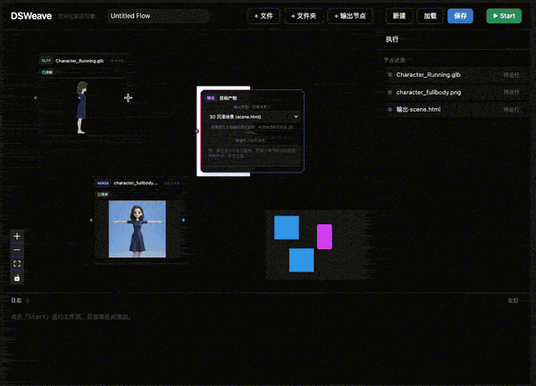

# DSWeave

**空间化知识引擎**：把文件拖进画布 → 用自然语言连线表达意图 → Agent 理解后产出一份**自包含的 3D 沉浸式知识场景（单文件 HTML/WebGL）**。

> 你只提供「素材 + 关系」，DSWeave 负责把它编排成一个可旋转、可点击、可离线打开的 3D 网页——无需写一行渲染代码。



上图是一次真实体验：拖入一个 `Character_Running.glb` 模型和一张 `character_fullbody.png` 图片，连到「输出节点」，输出类型选 **3D 沉浸场景（`scene.html`）**，点 **Start**，几秒后就得到一个把图片与模型空间化编排在一起的 3D 页面。

---

## 核心理念：Agent 只产「数据」，不写「代码」

DSWeave 刻意做了一个架构取舍——**把会出错的代码留在构建期，产物一定可运行**：

```
拖文件 → 文件理解 → Agent 产出 SceneSpec(纯数据) → Host 注入预构建 Player → 自包含 3D HTML
```

- **Agent 不写 Three.js/React 代码**，它唯一的交付物是一份符合 `SceneSpec` schema 的 JSON。
- **Player 是预构建的固定渲染器**（自研 R3F 运行时），把 `SceneSpec` + 资产注入后导出单文件 HTML。
- 因此产物**一定能跑、可离线双击打开、内容寻址可缓存**；代价是「能画什么」由一套**可扩展的视觉词汇表**决定，而非任意代码。

这也意味着 Agent 是**可插拔**的：`web → Host(内部协议) → Agent(官方 ACP over stdio)`。换 Agent，前端零改动。

---

## 视觉词汇表（SceneSpec 能表达什么）

| 原语 | 含义 | 来源文件 |
| --- | --- | --- |
| `models` | 3D 模型（可旋转、自动归一化居中） | `.gltf` `.glb` |
| `images` | 贴图平面（按真实宽高比） | `.png` `.jpg` `.webp` |
| `hotspots` | 绑定到模型**部件**的可点热点 → 弹出文档片段 | 由文档分块驱动 |
| `panels` | 文档侧栏/浮窗 | `.md` `.pdf` `.txt` `.html` |
| `connectors` | 元素之间的**有向箭头 + 标注**（如「生成」） | 由连线语义驱动 |
| `theme` / `layout` | 配色与并排/聚焦布局 | 由输出诉求驱动 |

> 词汇表是**平台能力、可一次性扩展**：新增一类视觉元素 = 给 `SceneSpec` 加一个原语 + 给 Player 加一个渲染零件，之后所有工作流都能让 Agent 自主组合使用。

---

## 工作流

1. **拖入文件**：画布上每个文件成为一个 source 节点，自动生成预览与「文件理解」（gltf 部件/材质、文档分块摘要、图片尺寸等）。
2. **连线表达意图**：在节点间连线并写自然语言语义（如「图片在左，箭头从图片指向模型，标注‘生成’」）。
3. **选输出类型**：输出节点选受限菜单中的类型（旗舰：`scene.html`）。
4. **Start**：Host 把「图 + 文件理解 + 上下文」喂给 Agent；Agent 产出 `SceneSpec`；Host 校验后注入 Player → 产出自包含 HTML，iframe 实时预览，也可单独下载离线打开。

执行过程（节点状态、工具调用、权限请求、日志）实时回流到右侧执行面板。

---

## Monorepo

| 包 | 职责 |
| --- | --- |
| `@dsweave/core` | 节点图 / IR / `SceneSpec` / 类型 / zod schema（前后端共享） |
| `@dsweave/protocol` | 内部 ACP 封装：图→prompt 编码、update→事件解码、transport 抽象、`capability/invoke` |
| `@dsweave/host` | Node 进程：WS 桥接、文件服务、文件理解、上下文工程、能力执行（`scene.html`）、Agent 管理（含官方 ACP 接入 Claude） |
| `@dsweave/agent` | 参考 ACP Agent（启发式 SceneSpec / Mock，可插拔） |
| `@dsweave/player` | 自研 R3F 3D 运行时，数据驱动渲染 `SceneSpec` → 自包含产物 |
| `@dsweave/web` | 前端编辑器：画布、文件预览、执行/产物/权限面板 |

---

## 可插拔 Agent（基于 ACP）

[ACP（Agent Client Protocol）](https://agentclientprotocol.com) 是 Agent 与编辑器之间的**通用开放协议**，并非 Claude 独有。DSWeave 的 Host 作为 ACP Client，任何遵循 ACP 的 Agent 都能经 stdio 接入——你完全可以**接入自定义 Agent**（只需实现 ACP 的 `initialize` / `session/new` / `session/prompt`，并通过 `fs/write_text_file` 产出 `scene.spec.json`），前端与协议/能力链路零改动。

通过 `DSWEAVE_AGENT` 选择内置 Agent：

| 值 | Agent | 说明 |
| --- | --- | --- |
| `scene`（默认） | 启发式 SceneSpec Agent | 确定性、无 LLM、无外网；用于打通与验证主链路 |
| `claude` | Claude Code | 经官方 ACP 适配器（`@agentclientprotocol/claude-agent-acp`）spawn 真实 LLM；产出 `scene.spec.json` 后由 Host 读取校验、失败回灌重试 |
| `mock` | 占位 Agent | 早期状态流验证 |

> 接入自定义 Agent：实现一个 ACP Agent（可参考 `@dsweave/agent`），用 ACP adapter 经 stdio 暴露，即可作为新的 `DSWEAVE_AGENT` 接入。

---

## 快速开始

```bash
pnpm install
pnpm build                         # 构建全部

# 起前端编辑器 + Host（两个终端）
pnpm dev:host                      # 默认启发式 Agent，ACP WS + 产物 HTTP，:8787
pnpm dev:web                       # 前端编辑器

# 用真实 Claude（需本机 Claude 登录态 / ANTHROPIC_API_KEY / 兼容网关）
DSWEAVE_AGENT=claude pnpm dev:host
```

打开前端后：拖入 `.glb`/图片/文档 → 连线写语义 → 输出节点选 `scene.html` → **Start**。

完整设计与里程碑见 [`docs/`](./docs/README.md)。

---

要求：**Node ≥ 20，pnpm ≥ 9**。
