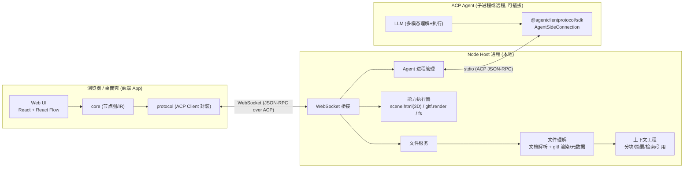
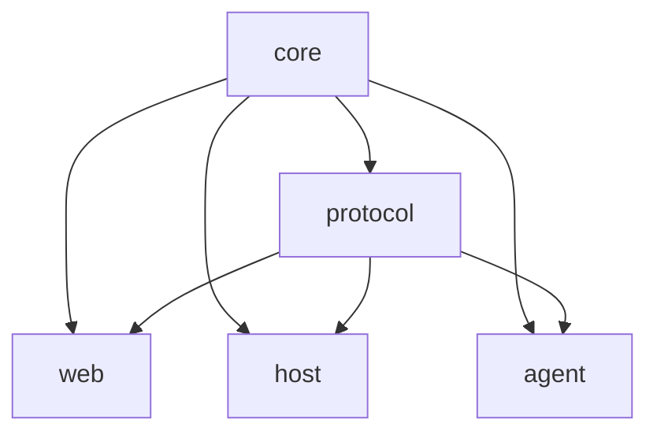
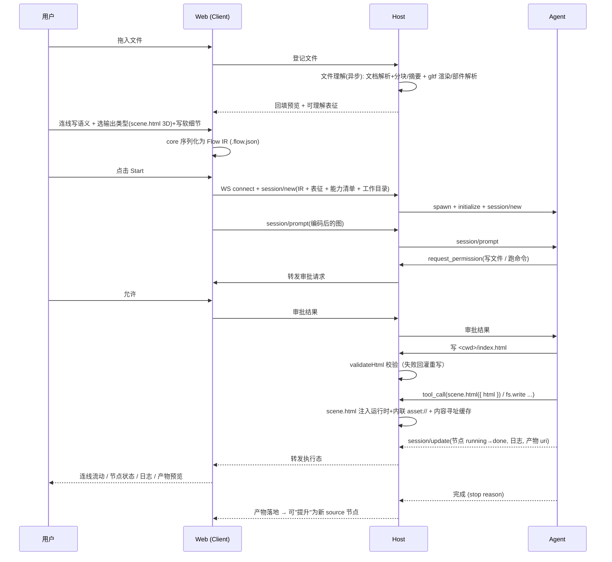
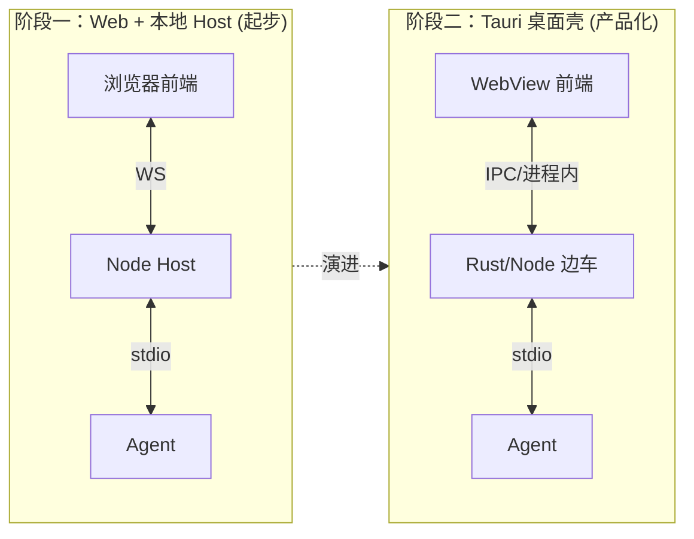
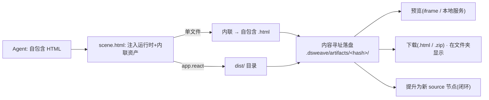

# DSWeave · 架构文档

> 文档版本：v0.2 ｜ 配套：`00-product-plan.md`、`02-technical-design.md`

> **架构演进（2026-06）**：主链路已由「Agent 产出 SceneSpec 数据 → 预构建 R3F Player 渲染」改为「Agent 直接撰写自包含 HTML，Host 后处理注入 model-viewer 运行时 + 内联 asset://{nodeId} 资产字节」。@dsweave/player 包与 SceneSpec 契约已移除，Monorepo 由 6 包收敛为 5 包（core/protocol/host/agent/web）。本文相关图与章节据此更新。

---

## 1. 架构总览

DSWeave 由四个逻辑角色组成，沿 **Client（编辑器）↔ Agent（执行者）** 的 ACP 模型展开：



**关键解耦点**：

1. **前端 ⟷ Host** 用 WebSocket 承载 ACP——浏览器也能用 ACP，未来套 Tauri 只需把 WebSocket 换成进程内通道。
2. **Host ⟷ Agent** 用标准 ACP stdio——任何符合 ACP 的 Agent（Mock / 自建 / Gemini CLI 等）即插即用。
3. `core` 与 `protocol` 是**前后端共享**的纯逻辑包，节点图与协议编解码只有一份真相。
4. **文件理解 + 上下文工程是 Host 的一等职责、也是产品主价值**：文档解析+分块+检索，**外加 gltf 离屏渲染与结构解析**，作为高质量上下文喂给 Agent。
5. **输出受限、3D 优先、HTML 自包含**：用户能选的输出严格等于注册表里真实存在的 `OutputType`。MVP 首发 **`scene.html`（3D 沉浸式 HTML/WebGL）**。**Agent 直接撰写自包含 HTML**；`scene.html` 能力对其做后处理——**注入 model-viewer 运行时（vendored `@google/model-viewer` UMD）+ 把 `asset://{nodeId}` 内联为 data URI 资产字节**，导出**自包含单文件 HTML**（离线、内容寻址可缓存）。Host 主循环还会对 Agent 写出的 HTML 做**纯文本校验回灌重试**（非空 / 无外链 script·link / `asset://` 仅引用 models∪images），失败则回灌重写。

---

## 2. ACP 角色映射

> ACP 中：**Client = 编辑器（我们的 App）**，**Agent = AI 执行者**。前端通过 `protocol` 包扮演 ACP Client，Agent 用 `AgentSideConnection`。

| ACP 概念 | 在 DSWeave 中的含义 |
| --- | --- |
| `initialize` | Host 启动 Agent，协商协议版本与能力 |
| `session/new` | 一次运行 = 一个 session（携带工作目录、能力清单、文件表征+上下文） |
| `session/prompt` | 把**整张节点图**（节点=文件+上下文(含 gltf 渲染图/部件)、边=语义文字、输出=受限类型+软细节）转为「图→自由 HTML 指令 + 上下文（含文档真实分块、可引用 nodeId）」 |
| `session/update`（流） | Agent 回传：思考、tool_call 状态、节点/连线执行态、产物 |
| tool_call / tool_call_update | Agent 调用工具（检索上下文、`scene.html` 传 `{ html }` → Host 注入运行时+内联资产、`fs.write`）；前端展示工具卡片 |
| `session/request_permission` | Agent 执行危险/写操作前请求审批 → 前端弹窗，用户允许/拒绝 |
| terminals | Agent 跑 shell（构建 React、转换等）；输出回流日志面板 |
| `fs/*`（Client 侧能力） | Host 提供文件读写给 Agent（受沙箱目录约束） |

> **已移除"计划预览"**：不再要求 Agent 先产出 md 计划再确认。改为执行态实时流式展示 + 仅对危险操作做 permission 审批。

---

## 3. Monorepo 结构

pnpm workspace + TypeScript Project References：

```
dsweave/
├─ package.json                # workspace 根
├─ pnpm-workspace.yaml
├─ tsconfig.base.json
├─ docs/                       # 本文档集
├─ packages/
│  ├─ core/                    # 节点图、IR、类型、序列化（零运行时依赖）
│  │   src/{model,ir,schema,index}.ts
│  ├─ protocol/                # ACP 封装：图→prompt 编码、update→状态解码
│  │   src/{client,encode,decode,transport,index}.ts
│  ├─ host/                    # Node 进程：WS 桥接、文件服务、文件理解+上下文工程、能力执行、Agent 管理
│  │   src/{server,bridge,fs-service,understanding,context,capabilities,agent-manager,index}.ts
│  │   # capabilities：scene.html HTML 后处理——注入 model-viewer 运行时 + 内联 asset://
│  ├─ web/                     # 前端 App（编辑器）：画布、预览、面板
│  │   src/{App.tsx,canvas/,nodes/,previews/,panels/,store/,acp/}
│  └─ agent/                   # 参考 ACP Agent（可选；亦可接外部 Agent），直接产出自包含 HTML
│      src/{agent.ts,tools/,index.ts}
└─ examples/                   # 示例 .flow.json 与素材
```

**依赖方向**（单向，禁止环）：



`core` 不依赖任何人；`protocol` 仅依赖 `core` 与 `@agentclientprotocol/sdk`；`web/host/agent` 是叶子。`host` 的 `scene.html` 能力把 Agent 写的自包含 HTML 做后处理——注入 model-viewer 运行时（vendored `@google/model-viewer` UMD）+ 内联 `asset://{nodeId}` 资产字节，生成自包含单文件产物。

---

## 4. 端到端数据流（执行一次工作流）



---

## 5. 运行形态演进



前端只面向 `protocol` 的抽象 transport，从 WebSocket 切到 Tauri IPC 时 **前端业务代码零改动**。

---

## 6. 产物（Artifact）处理与交付

> 产物处理是 gltf 输入的**镜像**：输入 gltf＝「根文件 + 依赖资源」，输出前端 app＝「入口 HTML + chunk/资产」。两端复用同一套 **Bundle（根 + 依赖清单）** 抽象（`FileRef.assets` / `Artifact`），不引入新概念。

两类产物：

- **自包含单文件**（`scene.html` / `report.html`，**默认**）：Agent HTML + model-viewer 运行时 + `asset://` 内联字节（data URI）全内联成一个 `.html`，双击即开、可分享、可缓存为单个 blob，前端 `<iframe>` 直接预览。
- **多文件 dist 目录**（`app.react`，复杂交付）：`<iframe>` 指向 blob 会因相对路径加载不到 chunk/资产（同 gltf 相对路径坑），故由 **Host 起本地静态服务** `/_artifacts/<hash>/` 用真实 URL 提供；下载则 `zip` 整个目录（或可选 singlefile 压成单文件）。



落盘内容寻址（`hash = f(最终 HTML 全文)`，运行时内嵌其中）二次运行命中缓存；产物可一键「提升」为新 `source` 节点喂给下一个工作流，多文件产物直接复用 `FileRef.assets`。详见 `02-technical-design.md` §5.4。

---

## 7. 安全与信任边界

- **沙箱工作目录**：每个 session 绑定工作目录，Agent 文件读写默认限制在其中。
- **审批闸门**：写文件 / 跑命令 / 网络访问经 `request_permission` 由用户确认；可"本会话记住"。
- **能力白名单**：Host 能力注册表是 Agent 可用动词的上界，未注册不可调用。
- **协议隔离**：协议破坏性变更集中在 `protocol` 包适配。

---

## 8. 横切关注点

| 关注点 | 方案 |
| --- | --- |
| 文件理解+上下文 | Host 入画时异步解析+分块+摘要，运行时按相关性检索喂给 Agent（核心攻坚） |
| 输出受限 | 输出菜单 = 注册表里未隐藏的 OutputType，每种背后有真实能力 |
| 状态管理 | 前端 Zustand（图状态 + 执行态分片），core IR 为持久化真相 |
| 缓存 | Host 内容寻址：key = hash(输入文件 + 边语义 + 工具版本) |
| 产物交付 | Bundle 抽象(根+依赖)：单文件优先(内联)，多文件 dist 走本地服务+zip；可提升为新 source 节点(闭环)。详见技术设计 §5.4 |
| 日志/可观测 | 结构化事件流（session/update 派生），前端时间线 + 终端镜像 |
| 错误处理 | 节点级 error 状态 + 可重试；Agent stop_reason 分类展示 |
| 测试 | core/protocol 单测；host 集成测（Mock Agent）；web E2E（Playwright） |
| 类型安全 | 端到端共享 zod schema（core 定义，protocol/web/host 复用） |
