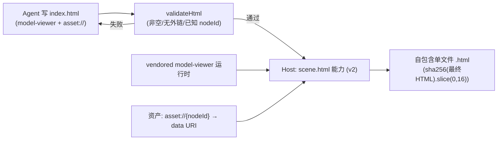
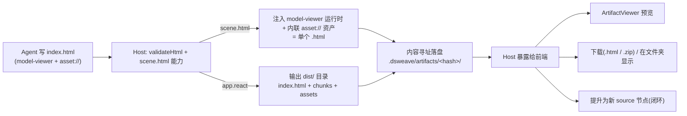
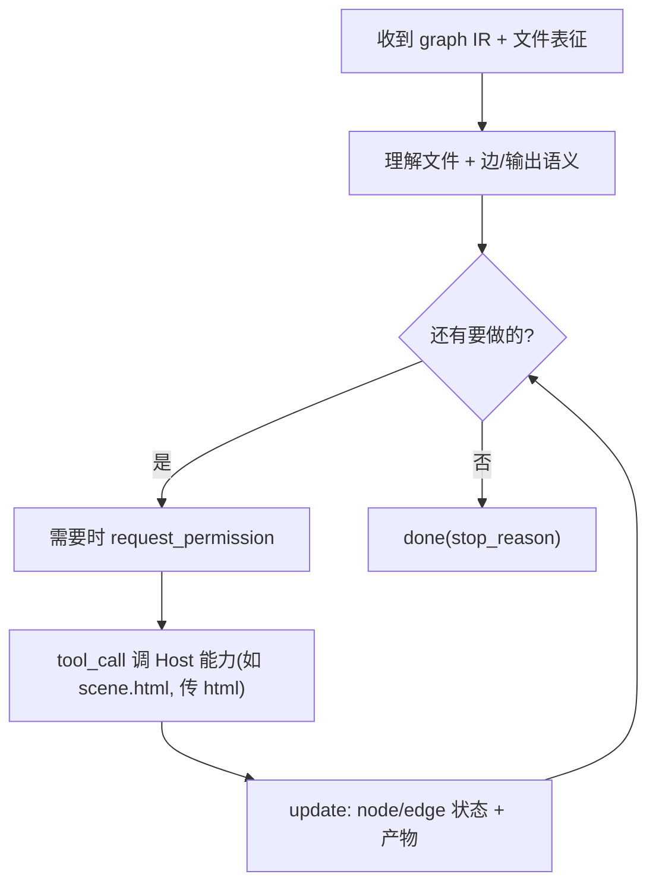
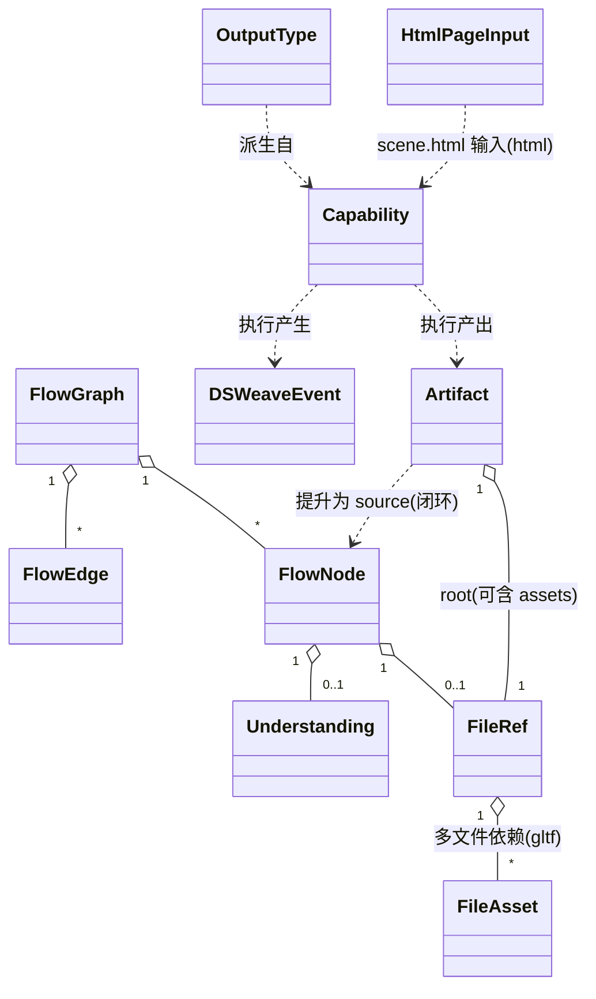

# DSWeave · 技术设计文档

> 文档版本：v0.2 ｜ 配套：`01-architecture.md`
> 代码为设计示意，最终以实现为准。

> **架构演进（2026-06）**：主链路已由「Agent 产出 SceneSpec 数据 → 预构建 R3F Player 渲染」改为「Agent 直接撰写自包含 HTML，Host 后处理注入 model-viewer 运行时 + 内联 asset://{nodeId} 资产字节」。SceneSpec 类型/zod、@dsweave/player 包均已移除。下文相关章节据此更新。

---

## 1. 技术选型一览

| 层 | 选型 | 理由 |
| --- | --- | --- |
| 语言 | TypeScript（strict） | 端到端类型一致 |
| 包管理 | pnpm workspace | Monorepo 友好 |
| 构建 | Vite（web）+ tsup/tsc（库） | 快、配置少 |
| 画布 | React Flow（@xyflow/react） | 成熟节点编辑器 |
| 状态 | Zustand | 轻量，适合图 + 执行态分片 |
| 样式 | Tailwind CSS | 快速高质量 UI |
| 校验 | Zod | 与 ACP SDK 一致，端到端共享 schema |
| ACP | `@agentclientprotocol/sdk` | 官方实现，JSON-RPC 2.0 |
| Host | Node + ws | spawn 进程、文件、文档处理、gltf 渲染 |
| 3D 运行时（产物） | `@google/model-viewer`（vendored UMD） | Agent 写 `<model-viewer>` 标签，Host 注入运行时脚本 |
| 单文件导出 | Host 后处理：注入 model-viewer 运行时 + `inlineAssets`（asset:// → data URI） | 把 Agent 写的 index.html + 运行时 + 资产 base64 内联成一个 .html |
| 3D 预览（画布内） | `<model-viewer>` | 节点内 gltf 预览（与产出运行时同源） |
| gltf 离屏渲染（理解） | three.js + headless-gl / puppeteer + model-viewer | 多角度渲染成图 |
| PDF 解析 | pdfjs-dist / pdf-parse | 正文 + 结构 + 图 |
| 网页正文抽取 | @mozilla/readability + jsdom | 去噪取正文 |
| Markdown 预览 | react-markdown + remark-gfm | md 渲染 |
| 分块/检索 | 自研 chunker + 向量检索（如 hnswlib/sqlite-vec，M3 评估） | 上下文工程 |
| OCR/视觉（图片） | 视觉模型 / tesseract（评估） | 图片转文字 |
| 桌面（后期） | Tauri | 体积小 |

> video/audio 的转写/抽帧选型后置，不在 MVP。

---

## 2. 节点图与 IR（`packages/core`）

> 概念澄清：节点＝文件，边＝语义文字，输出＝语义文字。没有隐藏算子。

### 2.1 核心类型

```ts
// MVP: gltf 模型 + 文档类并列；video/audio 后置
export type FileType = 'gltf' | 'md' | 'pdf' | 'txt' | 'html' | 'image' | 'data' | 'unknown';

// gltf 等多文件资源的依赖项（相对根文件目录的路径），如 .bin 与纹理
export interface FileAsset {
  path: string;                              // 相对根目录的路径（已 decode）
  mime?: string;
  size?: number;
  hash?: string;
  role?: 'buffer' | 'image' | 'other';
}

export interface FileRef {
  uri: string;            // 逻辑标识：原始文件名 / 工作目录相对路径（可持久化，非运行时 blob）
  mime: string;
  type: FileType;
  size?: number;
  hash?: string;          // 内容寻址（缓存键的一部分）
  assets?: FileAsset[];   // 多文件资源的依赖清单（gltf 的 .bin/纹理）；缺省=自包含单文件（.glb / 内嵌 data:）
}

// 给人看的预览
export interface PreviewMeta {
  thumbnail?: string;     // 首页缩略 / 截图
  excerpt?: string;       // 正文摘录
  pageCount?: number;     // pdf 页数
  rows?: number;          // data 行数
}

// 给 Agent "读懂"的表征（核心，见 §3）
export interface Understanding {
  text?: string;                       // 正文 / 抽取文本
  summary?: string;                    // 层级摘要
  chunks?: Chunk[];                    // 分块（可检索）
  outline?: { level: number; title: string }[]; // 标题层级
  schema?: Record<string, unknown>;    // data 类文件的字段/统计
  captions?: string[];                 // 图片/渲染图的视觉描述 / OCR
  renders?: string[];                  // gltf 多角度渲染图 uri（喂多模态）
  model?: ModelMeta;                   // gltf 结构元数据
  metadata?: Record<string, unknown>;
  ready: boolean;
}

// gltf 模型理解结果
export interface ModelMeta {
  nodes?: { name: string; meshIndex?: number }[]; // 部件/节点名，供热点绑定
  materials?: string[];
  animations?: string[];
  bbox?: { min: [number, number, number]; max: [number, number, number] };
}

export interface Chunk {
  id: string;
  text: string;
  source: { nodeId: string; loc?: string }; // 引用可追溯（页码/段落）
  embedding?: number[];                      // 可选，检索用
}

export type NodeKind = 'source' | 'output';

export interface FlowNode {
  id: string;
  kind: NodeKind;
  position: { x: number; y: number };
  label?: string;
  file?: FileRef;                 // kind === 'source'
  output?: OutputSpec;            // kind === 'output'
  preview?: PreviewMeta;          // 运行时回填
  understanding?: Understanding;  // 运行时回填，喂给 Agent
  status?: ExecStatus;            // 运行时
}

// 受限输出：从能力注册表派生的固定类型 + 自然语言软细节
export interface OutputSpec {
  typeId: string;                 // 'scene.html' | 'report.html' | 'app.react' | 'custom'
  spec: string;                   // 自然语言软细节（风格/结构/文案）
  params?: Record<string, unknown>; // 受输出类型 schema 约束的硬参数
}

export interface FlowEdge {
  id: string;
  source: string;
  target: string;
  semantics: string;              // 自然语言：这条连线代表什么
  params?: Record<string, unknown>;
  status?: ExecStatus;
}

export type ExecStatus = 'idle' | 'running' | 'done' | 'error';

export interface FlowGraph {       // 持久化为 .flow.json
  version: 1;
  id: string;
  name: string;
  nodes: FlowNode[];
  edges: FlowEdge[];
  meta?: { createdAt: string; updatedAt: string };
}
```

### 2.2 IR 与序列化

- `FlowGraph` 即 IR，`JSON.stringify` 存为 `.flow.json`。
- 运行时字段（`preview` / `understanding` / `status`）序列化时剥离，只存结构。
- 提供 `validateFlow`（zod）、`stripRuntime`、`hashNode`。

---

## 3. 文件理解与上下文工程（核心攻坚 · 产品主价值）

> DSWeave 的护城河：把一堆杂乱文件变成 Agent 能用好的上下文。分两层——**解析（parse）** 与 **上下文工程（context engineering）**。

### 3.1 解析管线（按文件类型）

| 类型 | 生成的 `Understanding` | 实现手段 |
| --- | --- | --- |
| **gltf** | `renders`(多角度图) + `model`(部件/材质/动画/包围盒) + `captions` | 离屏渲染（three.js/headless-gl 或 puppeteer+model-viewer）+ 解析 glTF JSON |
| md / txt | `text` + `outline` | 直接读 + 标题分节 |
| pdf | `text` + `outline` + `metadata`(页数) + `captions`(图) | pdfjs/pdf-parse |
| html / 网页 | `text`(正文) | readability 去噪 |
| data (csv/json) | `schema` + `summary`(统计) | 解析 + 摘要 |
| image | `captions`(OCR + 视觉描述) | OCR / 视觉模型 |

> gltf 理解的两个产物都关键：`renders` 让 Agent"看见"模型外观；`model.nodes`（部件名）让 Agent 能把文档章节**绑定到具体部件**做 3D 热点。

```ts
export interface UnderstandingProvider {
  type: FileType;
  understand(file: FileRef, io: UnderstandIO): Promise<Understanding>;
}
// host 注册 provider，入画时异步执行，回填 node.understanding
```

### 3.2 上下文工程（解析之上）

1. **分块（chunking）**：长文档按 outline/语义切成 `Chunk[]`，每块带来源（nodeId + 页/段）以支持**引用追溯**。
2. **摘要（summary）**：对每文件/每块生成层级摘要，给 Agent 先看全局。
3. **检索（retrieval）**：知识库大时**不全量塞入上下文**；按边语义/输出目标做相关性检索，挑相关 chunk 喂给 Agent。
   - MVP 文档少时可全量；预留向量检索（embedding）应对规模化。

```ts
export interface ContextBuilder {
  // 依据图（边语义 + 输出目标）选取喂给 Agent 的上下文
  build(graph: FlowGraph, opts: { maxTokens: number }): {
    files: { nodeId: string; summary?: string; chunks: Chunk[] }[];
    retrieval: 'full' | 'topk';
  };
}
```

### 3.3 喂给 Agent 的方式

- 文本型（`text`/`summary`/`chunks`/`schema`/`captions`）随 prompt 作为结构化上下文发送。
- 图片可作为多模态内容块发送给支持视觉的 Agent。
- 表征**异步、可流式**生成；`ready=false` 前端显示"理解中"，Start 等待关键节点 `ready`。

### 3.4 质量即上限

解析准确度、分块粒度、检索相关性、**gltf 渲染与部件提取** 直接决定产物质量，单列攻坚。MVP 先把 **文档解析 + 分块/摘要 + 引用追溯** 与 **gltf 渲染/部件名** 做扎实（支撑 `scene.html` 主竖切）；向量检索按规模择机引入。

---

## 4. ACP 协议封装（`packages/protocol`）

### 4.1 Transport 抽象

```ts
export interface AcpTransport {
  send(msg: unknown): void;
  onMessage(cb: (msg: unknown) => void): void;
  close(): void;
}
// 实现：WebSocketTransport（前端↔Host）、StdioTransport（Host↔Agent）
```

前端业务只依赖 `AcpTransport`，WS→Tauri IPC 迁移无感。

### 4.2 图 → Prompt 编码（`encode.ts`）

```ts
export function encodeGraphToPrompt(graph: FlowGraph, ctx: SessionContext): PromptInput {
  return {
    instructions: SYSTEM_TEMPLATE,           // 角色 + 能力约束（不含计划阶段）
    graph: stripRuntime(graph),              // 结构：节点/边/输出
    capabilities: ctx.capabilities,          // Host 可用动词
    workingDir: ctx.workingDir,
    context: ctx.contextBuilder.build(graph, { maxTokens: ctx.budget }), // 解析+分块+检索后的上下文
    outputs: graph.nodes.filter(n => n.kind === 'output').map(n => n.output), // {typeId, spec, params}
  };
}
```

> 输出是**受限类型**（`typeId` 从注册表选），因此 Agent 收到的是"用 `scene.html` 能力、撰写一份自包含 `index.html`（用 `<model-viewer>` 展示模型、用 `asset://{nodeId}` 引用资产、把文档片段写进正文/面板，软细节按 spec）"这种**有界任务**：Agent 写的是受约束的 HTML（禁外链、仅引用已知 nodeId），由 Host 后处理注入运行时并内联资产。

**要点**：
- 用 `nodeId/edgeId` 作稳定锚点，Agent 在 `session/update` 回引节点 → 前端精确高亮。
- 声明能力清单约束 Agent 不臆造工具。
- **不再要求"先出计划"**：直接执行，过程通过 update 流透明展示，危险操作走审批。

### 4.3 Update → 执行态解码（`decode.ts`）

```ts
export type DSWeaveEvent =
  | { kind: 'node-status'; nodeId: string; status: ExecStatus; message?: string }
  | { kind: 'edge-status'; edgeId: string; status: ExecStatus }
  | { kind: 'tool-call'; id: string; title: string; state: 'pending'|'running'|'done'|'error' }
  | { kind: 'log'; level: 'info'|'warn'|'error'; text: string }
  | { kind: 'artifact'; uri: string; mime: string; fromNodeId?: string }
  | { kind: 'permission-request'; id: string; summary: string; options: string[] }
  | { kind: 'done'; reason: string };
```

约定：Agent 在工具元数据里携带 `nodeId`/`edgeId`，`decode` 负责归一化。

### 4.4 Client 封装

```ts
export class DSWeaveAcpClient {
  constructor(private transport: AcpTransport) {}
  async newSession(ctx: SessionContext): Promise<SessionId>;
  async run(graph: FlowGraph): AsyncIterable<DSWeaveEvent>;
  async respondPermission(id: string, allow: boolean): Promise<void>;
  cancel(): void;
}
```

---

## 5. Host（`packages/host`）

### 5.1 职责

1. **WS 服务**：前端连接，作为 ACP Client↔Agent 中继 + 本地能力提供方。
2. **Agent 管理**：spawn/连接 Agent，`AgentSideConnection` 走 stdio（可插拔）。
3. **文件服务**：本地文件 → 带 hash 的资源；生成 `PreviewMeta`。
4. **文件理解**：运行 `UnderstandingProvider`（含 gltf 离屏渲染 + glTF 解析），生成 `Understanding`（§3）。
5. **能力执行器**：注册/执行"动词"，结果回写工作目录 + 缓存。
6. **缓存**：内容寻址，避免重复计算。

### 5.2 能力注册表 + 输出类型注册表（输出受限的根基）

```ts
export interface Capability {
  name: string;                 // 'scene.html'
  description: string;          // 给 Agent 看的自然语言
  inputs: CapIO[]; outputs: CapIO[];
  run(args: Record<string, unknown>, io: CapRunIO): Promise<CapResult>;
}

// 输出菜单从能力派生：每个输出类型背后必须有一个真实能力
export interface OutputType {
  id: string;                   // 'scene.html'
  label: string;                // '3D 沉浸页 (WebGL HTML)'
  produces: string;             // mime, 'text/html'
  acceptsFileTypes: FileType[]; // 允许的输入文件类型
  backingCapability: string;    // 对应 Capability.name
  paramsSchema?: ZodType;       // 硬参数约束
  hidden?: boolean;             // custom 默认隐藏
}
```

MVP 输出类型与能力（按解锁顺序）：

| OutputType | backingCapability | 状态 |
| --- | --- | --- |
| `scene.html` | `scene.html`（Agent 写 index.html → Host 注入 model-viewer 运行时 + 内联 asset:// 资产 → **自包含 3D 沉浸式单文件 HTML**） | **MVP 首发** |
| `report.html` | 同能力（不需要 3D 时 Agent 写纯文档型 HTML，无 `<model-viewer>`） | 备选 |
| `app.react` | `app.react`（多文件工程/dist 形式导出，复杂交付） | 次发 |
| `custom` | `custom.bestEffort`（尽力而为，不保证） | 后期、默认隐藏 |

> `scene.html` / `report.html` 走**同一条后处理链路**（注入运行时 + 内联资产 + 内容寻址），区别只在 Agent 是否写 `<model-viewer>`；`app.react` 走多文件 dist 交付。

辅助能力：`gltf.render`（gltf→多角度图，兼作理解与产出）、`fs.write`（写产物）、`fetch.web`（联网检索，后期、permission 约束）。

> **前端输出菜单 = 注册表里 `hidden!==true` 的 OutputType**，严格等于"Host 真能生产的东西"。

### 5.3 `scene.html` 生成策略（旗舰，关键）——Agent 写 HTML + Host 后处理

核心原则：**Agent 直接撰写自包含 `index.html`，但写的是受约束的 HTML（禁外链、仅用 `asset://{nodeId}` 引用已知资产、用 `<model-viewer>` 展示模型）；"会出错/不稳定的运行期依赖"（model-viewer 运行时、资产字节）由 Host 在后处理期确定性注入，而非 Agent 现写或现拉。**

三个角色：

1. **Agent（产出 HTML）**：唯一产出物是一份自包含的 `index.html`——用 `<model-viewer>` 标签展示模型、用 `asset://{nodeId}` 占位引用模型/图片、把文档片段按语义写进正文/面板。**不写运行时脚本、不外链 CDN、不内联资产字节**，只写结构与内容。
2. **校验（`validateHtml`）**：ACP 主循环读取 `<cwd>/index.html` 后做纯文本校验——非空、无外链 `<script src>`/`<link href>`、`asset://` 仅引用 `models ∪ images` 的已知 nodeId；失败则把错误回灌给 Agent 重写。
3. **`scene.html` 能力（Host，version `'2'`）**：对校验通过的 HTML 做确定性后处理 → 导出**自包含单文件 HTML**。这是后处理而非现场打包，所以又快又稳。

**能力实现步骤**（`packages/host/src/capabilities/scene-html.ts`）：

1. 校验入参 `html` 非空。
2. `injectViewerRuntime(html, getModelViewerScript())`：把 vendored 的 `@google/model-viewer` UMD 运行时脚本注入页面。
3. `inlineAssets(html, resolve)`：把每个 `asset://{nodeId}` 替换为 `data:{mime};base64,...`；mime 取自 `stored.ref.mime`，回退按扩展名猜测。
4. 缺失引用（无法解析的 nodeId）直接抛错。
5. `sha256(html).slice(0,16)` 对**最终 HTML 全文**做内容寻址落盘（运行时已内嵌，等价旧设计「key 含 Player 版本」）。

**新增 Host 模块**（各带 `*.check.ts`，用 tsx + `node:assert` 自测）：

| 模块 | 职责 |
| --- | --- |
| `export/inline-html.ts` | `inlineAssets`（asset:// → data URI）、`injectViewerRuntime`（注入运行时） |
| `export/validate-html.ts` | `validateHtml`（非空 / 无外链 / asset:// 仅引用已知 nodeId） |
| `export/model-viewer-runtime.ts` | `getModelViewerScript`（返回 vendored model-viewer UMD 脚本） |

**协议输入**：`scene.html` 能力的输入为 `HtmlPageInput { html: string }`（旧的 `SceneHtmlInput { spec: SceneSpec }` 已删）。

**Prompt 工程**（`packages/host/src/claude/prompt.ts`）：指示 Agent 产出自由 HTML，并附 RULES——写自包含 `index.html`、用 `asset://{nodeId}` 引用资产、用 `<model-viewer>` 展示模型、禁外链、按语义写够长的正文（≥N 字）；同时携带 `<DSWEAVE_CONTEXT>` JSON（models/images/docs 的真实分块文本 + `knownNodeIds = models ∪ images`）。`OUTPUT_FILENAME = 'index.html'`。

**ACP 主循环**（`packages/host/src/claude/acp-agent.ts`）：读取 `<cwd>/index.html` → `validateHtml(html, knownNodeIds)` → 失败把错误回灌让 Agent 重写 → 通过后 `invokeCapability('scene.html', { html })`。

> SceneSpec 接口、core 的 `zSceneSpec`/`validateSceneSpec`/`safeValidateSceneSpec`、`@dsweave/player` 整包、`inject-player.ts` **均已移除**。"自由 HTML + `asset://` 约定 + 纯文本校验"取代了原先的「SceneSpec schema + 字段表 + zod 校验」。



**收益**：
- **可靠**：运行时与资产由 Host 后处理确定性注入；Agent 写的 HTML 经纯文本校验+重试兜底，禁外链保证离线自包含。
- **可缓存**：内容寻址 hash = 最终 HTML 全文（运行时已内嵌），命中即复用。
- **表现力强**：`<model-viewer>` 提供开箱即用的模型加载/相机/热点能力。
- **交付灵活**：默认单文件 HTML（双击即看/可分享）。
- **平滑长出 `app.react`**：复杂交付版＝多文件工程形式导出。

### 5.4 产物（Artifact）处理与交付

> 关键洞察：**产物处理是 gltf 输入的"镜像"**。输入的 gltf 是「根文件 + 依赖资源」，输出的前端 app 也是「入口 HTML + 一堆 chunk/资源」。因此产物复用与 `FileRef` 同构的 **Bundle（根 + 依赖清单）** 抽象，不引入新概念。

#### 5.4.1 Artifact 类型（属于 `core`）

```ts
export interface Artifact {
  id: string;
  outputTypeId: string;                 // 'scene.html' | 'report.html' | 'app.react'
  produces: string;                     // mime；目录产物为 'inode/directory'
  delivery: 'single-file' | 'directory';// 交付形态
  root: FileRef;                         // 入口文件（如 index.html / scene.html）
  // root.assets 复用 FileRef.assets：directory 交付时列出 dist 内的 chunk/资产
  createdFromHash: string;              // 缓存键 = sha256(最终 HTML 全文).slice(0,16)（运行时已内嵌）
  fromNodeId?: string;                  // 由哪个 output 节点产生
  bytes?: number;                       // 总字节
}
```

#### 5.4.2 两类产物，处理方式不同

| 输出类型 | 形态 | 交付 | 预览 |
| --- | --- | --- | --- |
| `scene.html` / `report.html` | **自包含单文件** | 双击即开，零依赖 | `<iframe>` 用 blob/srcdoc 直接预览 |
| `app.react` | **多文件 dist 目录** | Host 起本地静态服务 + zip 下载（可选 singlefile 压成单文件） | `<iframe src>` 指向 Host 服务 URL |

> 技术点：**多文件 dist 用 `<iframe>` 指向 blob 会因相对路径加载不到 chunk/资产**——与 gltf 相对路径同一个坑。两条解法：① 全部内联成单文件；② Host 用真实 URL 提供静态服务。单文件优先。

#### 5.4.3 Host 侧处理流程（M4）



1. **落盘 + 缓存**：写入沙箱工作目录 `./.dsweave/artifacts/<hash>/`，`hash = sha256(最终 HTML 全文).slice(0,16)`（model-viewer 运行时已内嵌，等价旧设计「key 含 Player 版本」）。二次运行命中缓存秒出。
2. **预览**：单文件流给前端用 `<iframe>` 预览；多文件 dist 由 Host 在本地 HTTP 服务挂载 `/_artifacts/<hash>/index.html`，`<iframe src>` 指向它（相对资产正常解析）。未来 Tauri 换自定义协议，前端零改。
3. **交付/下载**：单文件直接存 `index.html`（可分享、双击即看）；多文件 `zip` 整个 dist（`app.react`）。「在文件夹中显示」由 Host 调系统打开。
4. **提升为新 source 节点（闭环）**：产物一键变成画布上的新 `source` 节点喂给下一个工作流（呼应"一切皆文件"）。多文件产物直接复用 `FileRef.assets`（根 + 依赖清单），无需新抽象。

#### 5.4.4 默认策略

**默认走单文件交付**（`scene.html` / `report.html`）：可分享、可缓存为单个 blob、无需服务、确定性最好。`app.react`（目录）只留给真正需要复杂交互/路由的场景，交付时给 zip + 本地预览服务两种。

> `DSWeaveEvent` 的 `artifact` 事件携带 `Artifact`（或其 id），前端据此驱动 `ArtifactViewer`。

### 5.5 缓存键

```
cacheKey = sha256(capability.name + version + sortedInputHashes + JSON(normalizedParams))
```

命中直接返回产物 uri，节点标 `done(cached)`。

---

## 6. 参考 Agent（`packages/agent`，可插拔）

> 也可不实现，直接接外部 ACP Agent（如 Gemini CLI）。提供它用于端到端可控与演示。

- 基于 `@agentclientprotocol/sdk` 的 `AgentSideConnection`。
- 收到 prompt（含各文件的 `Understanding`）→ 直接进入执行：理解意图 → 调 Host 能力 → 回传状态与产物。
- `tools/`：把 Host 能力暴露为 ACP tool_call。



---

## 7. 前端（`packages/web`）

### 7.1 组件结构

```
App
├─ Toolbar            (新建/保存/加载/Start/Cancel)
├─ Canvas             (React Flow)
│   ├─ SourceNode     (按 fileType 选预览; 显示"理解中/已理解"状态)
│   │   ├─ VideoPreview / AudioPreview / GltfPreview / MarkdownPreview / ImagePreview
│   └─ OutputNode     (目标类型 + 自然语言规格表单)
├─ EdgeEditor         (点击边 → 编辑 semantics / params)
├─ Inspector          (选中节点/边属性 + 文件理解结果预览)
├─ ExecutionPanel     (节点进度 / 工具卡片)
├─ LogTimeline        (结构化日志 + 终端镜像)
├─ PermissionDialog   (审批弹窗)
└─ ArtifactViewer     (产物预览, 3D HTML 内嵌 iframe 可交互; 可"提升"为新 source 节点)
```

### 7.2 状态分片（Zustand）

```ts
interface DSWeaveStore {
  graph: FlowGraph;                          // 结构（持久化真相）
  runtime: Record<string, ExecStatus>;       // nodeId/edgeId → 状态
  understanding: Record<string, Understanding>; // nodeId → 文件理解
  logs: LogEntry[];
  artifacts: Artifact[];
  pendingPermission?: PermissionRequest;
  addFileNode(file): void;
  connect(source, target, semantics): void;
  updateEdgeSemantics(id, text): void;
  setOutput(nodeId, spec): void;
  start(): Promise<void>;     // 调 DSWeaveAcpClient.run，消费 DSWeaveEvent
  respondPermission(allow): void;
}
```

### 7.3 拖入文件 → 节点

1. `onDrop` → 登记到 Host → 得到 `FileRef`（含 hash）。
2. Host 异步生成 `PreviewMeta`（给人看）与 `Understanding`（给 Agent 看），流式回填。
3. 节点显示预览 + "理解中/已理解"徽标。

**多文件资源（gltf 文件夹）摄入**：`.gltf` 会引用外部 `.bin` 与纹理（常带子目录），是一个「文件夹」而非单文件。前端支持两条采集路径：
- 拖入文件夹：`DataTransferItem.webkitGetAsEntry()` 递归读目录（带相对路径）；
- 「+ 文件夹」按钮：`<input webkitdirectory>`，用 `webkitRelativePath`。

采集后按 bundle 归并：解析 gltf 的 `buffers/images[].uri`，按相对路径匹配出依赖，记入 `FileRef.assets`；被引用的纹理/`.bin` **不**单独成节点。M1（纯前端预览）把相对 uri 改写为 `blob:` 绝对 URL 喂给 `<model-viewer>`；M2+ 接入 Host 后用工作目录真实路径解析，不再需要 blob。`.glb` 与内嵌 `data:` 的 gltf 为自包含单文件（`assets` 为空）。

### 7.4 预览方案

| 类型 | 方案 |
| --- | --- |
| gltf | `<model-viewer>` 节点内 3D 预览（可旋转、自动转） |
| md / txt | react-markdown + remark-gfm，节点内滚动渲染 |
| pdf | pdfjs 首页缩略 + 页数 + 正文摘录 |
| html / 网页 | 正文摘录卡片（readability 抽取） |
| data (csv/json) | 表头 + 前几行 / JSON 树 + 行数 |
| image | `` 适配缩放（hover 看 OCR 摘要） |

### 7.5 执行态可视化

- 节点边框随 `ExecStatus`（灰/蓝脉冲/绿/红）。
- 执行中的边用 React Flow 动画虚线。
- 工具调用以卡片进入 `ExecutionPanel`，可展开看参数与输出。

---

## 8. 端到端类型契约



Monorepo 现为 **5 包**（`@dsweave/player` 已移除）：

- `core`：`FlowGraph` 系列 + `FileRef`/`FileAsset` + `Understanding`/`Chunk` + `Artifact` + zod schema（唯一真相）。SceneSpec 类型及其 zod（`zSceneSpec`/`validateSceneSpec`/`safeValidateSceneSpec`）**已移除**。
- `protocol`：`DSWeaveEvent`/`PromptInput` + `HtmlPageInput`，依赖 `core`。
- `host`：`Capability` + `OutputType` + `UnderstandingProvider` + `ContextBuilder` + `scene.html` 能力（`export/inline-html.ts`、`validate-html.ts`、`model-viewer-runtime.ts`），依赖 `core`/`protocol`；新增依赖 `@google/model-viewer`。
- `agent`：参考 ACP Agent（可插拔）。
- `web`：消费全部，输出菜单 = 注册表里未隐藏的 `OutputType`。

---

## 9. 开放技术问题（实现期决议）

1. gltf 离屏渲染方案选型（headless-gl vs puppeteer+model-viewer）、机位数量与一致性。
2. 单文件 HTML 的体积控制（model-viewer 运行时 + 资产 base64 内联可能偏大；是否提供"外链资产"模式）。
3. model-viewer 运行时的版本化（vendored UMD 升级后旧产物的复现/兼容）。
4. HTML 校验（`validateHtml` 纯文本规则）的覆盖度与 Agent 产出不合法时的回灌/重试上限。
5. 大文件在前端↔Host 间传输（流式分片 vs 仅传路径；桌面态直接传路径）。
6. 上下文工程成本/延迟（分块粒度、是否上向量检索、token 预算）。
7. 引用追溯/热点的粒度（页/段/句 ↔ 模型部件）。
8. 缓存失效策略（能力版本、model-viewer 运行时版本、源文件变更、provider 版本）。
