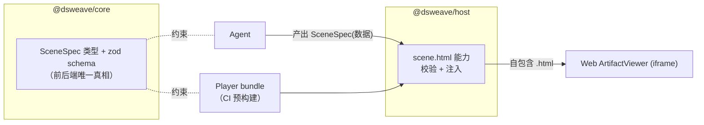
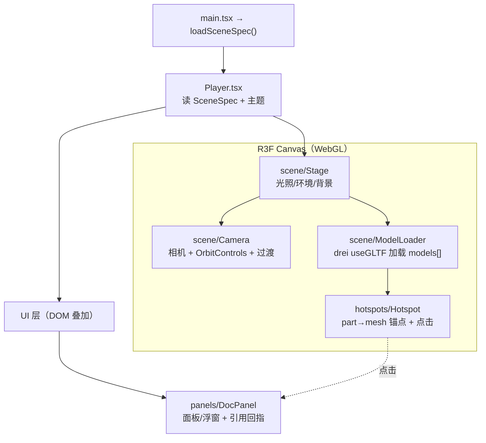
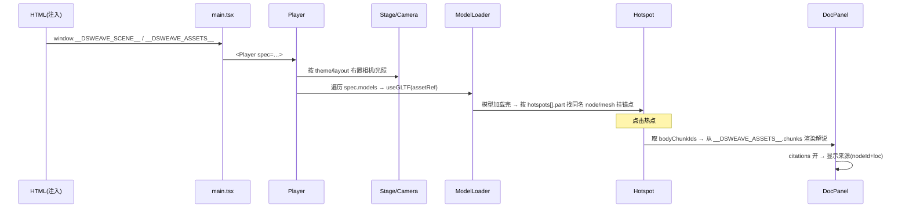
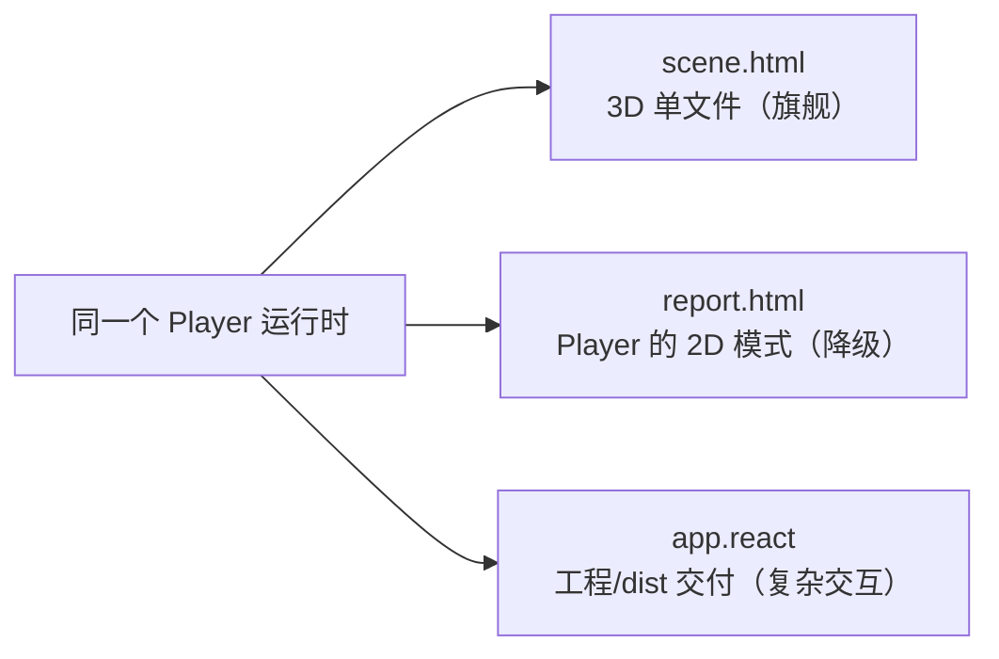

# DSWeave · R3F Scene Player 技术文档

> ⚠️ 已废弃：自 2026-06 起 DSWeave 改为 Agent 直接产出自包含 HTML（Host 注入 model-viewer 运行时 + 内联资产），不再使用预构建 R3F Player。本文档仅作历史参考。

> 文档版本：v0.1 ｜ 配套：`02-technical-design.md`（§5.3 scene.html 生成、§4 SceneSpec）、`01-architecture.md`
> 对象：`packages/player`。本篇是 Player 的单一权威说明，代码为最终准。

---

## 1. 定位与一句话定义

**Scene Player 是 DSWeave 自研、CI 预构建并测试过的 3D 运行时（React + React Three Fiber + drei）。它数据驱动：唯一输入是一份 `SceneSpec`（纯 JSON）+ 资产，据此渲染出可旋转、漫游、点击热点的 3D 知识场景。**

它**不是**通用文件查看器，而是一个"把结构化数据组装成 3D 场景"的组合器。文件格式的多样性由 Host 的文件理解层（M3）吸收，Player 只面对两种东西：**3D 模型（gltf）** 与 **被理解后的结构化内容（文档分块 / 元数据 / 图片）**。

三种受限输出（`scene.html` / `report.html` / `app.react`）**共用这同一个运行时**，区别只在交付封装。

---

## 2. 设计原则：数据驱动 = 可靠性

整个 Player 的存在理由是一条铁律：

> **把"会出错的代码"从 Agent 运行期挪到我们的构建期。Agent 永远只产出数据（SceneSpec），绝不产出代码。**

| 反模式（不采用） | DSWeave 做法 |
| --- | --- |
| 让 Agent 现写 Three.js / WebGL 代码 | Agent 只产出 `SceneSpec`（数据） |
| 产物每次现场编译、可能跑不起来 | Player 是仓库代码、**CI 编译+测试**，运行期只灌数据 |
| 结果不可缓存、任务无界 | 产物确定、可内容寻址缓存；Agent 任务有界（产出合法 JSON） |

由此带来：**产物一定能运行**、**可缓存**、**Agent 可插拔**（换 Mock/自建/外部对 Player 无感）。

---

## 3. 在系统中的位置



- **依赖方向**：`player` 只依赖 `core`（拿 `SceneSpec` 类型）。不依赖 `protocol`/`host`/`agent`。
- **构建关系**：`player` 由 CI 预构建出 bundle；`host` 的 `scene.html` 能力在**运行期注入** `SceneSpec`，**不在运行期编译 player**。
- **Player 不认识 Agent，Agent 不认识 Player**：二者通过 `SceneSpec` 契约解耦，Host 是中间人（校验 + 注入）。

---

## 4. 输入契约：`SceneSpec`

唯一输入，定义在 `core`（`packages/core/src/scene-spec.ts`），由 zod 校验（`zSceneSpec`）。

```ts
interface SceneSpec {
  version: 1;
  theme: { palette: string; style: string };   // 软细节：配色 / 风格
  layout: 'single-focus' | 'gallery';           // 单模型精讲 / 知识展厅
  models: {
    nodeId: string;          // 指回画布上的 gltf source 节点
    assetRef: string;        // 产物内资产引用（内联 id / 相对路径）
    placement?: Transform;   // 位置/旋转/缩放
    autoRotate?: boolean;
  }[];
  hotspots: {
    modelNodeId: string;     // 绑定到哪个模型
    part: string;            // 部件名 = ModelMeta.nodes[].name（M3 gltf provider 解析）
    title: string;
    bodyChunkIds: string[];  // 解说正文 = Understanding.chunks[].id（M3 文档分块）
  }[];
  panels: { title: string; chunkIds: string[] }[];  // 文档面板/浮窗
  citations: boolean;        // 是否呈现来源引用
}
```

### 4.1 与 M3 文件理解的咬合（关键）

Player 的字段不是凭空设计，而是**直接消费 M3 的产出**：

| SceneSpec 字段 | 来源（M3 `Understanding`） | 渲染成 |
| --- | --- | --- |
| `models[].nodeId` | gltf source 节点 | 加载到场景的 3D 模型 |
| `hotspots[].part` | `ModelMeta.nodes[].name`（部件名） | 模型上某个 mesh/node 的可点击锚点 |
| `hotspots[].bodyChunkIds` | `Understanding.chunks[].id`（带 `source.loc`） | 点击热点弹出的解说文本 |
| `panels[].chunkIds` | 同上 | 侧栏/浮窗文档面板 |
| `citations` | `chunks[].source`（nodeId + loc） | 解说下方的来源回指 |

> 一句话：**M3 解析出"部件名 + 文档分块"，Agent 用 SceneSpec 把它们绑定，Player 把绑定关系渲染成可交互 3D 热点与引用回指。**

### 4.2 资产（assets）

`SceneSpec` 只携带**引用**（`assetRef` / `chunkIds`），真实字节随产物注入：
- **glb 模型**：base64 内联到 HTML（单文件交付），或 dist 内相对路径（`app.react`）。
- **文档 chunk 文本**：作为数据一并注入（见 §5）。
- **图片**：base64 / 相对路径。

---

## 5. 运行时注入机制

Player 不在运行期编译，而是预构建为 bundle，再由 Host 注入数据。约定通过全局变量传递：

```7:25:packages/player/src/spec.ts
declare global {
  interface Window {
    __DSWEAVE_SCENE__?: SceneSpec;
  }
}

export const DEMO_SPEC: SceneSpec = {
  version: 1,
  theme: { palette: 'dark-tech', style: 'minimal' },
  layout: 'single-focus',
  models: [],
  hotspots: [],
  panels: [{ title: 'DSWeave Scene Player', chunkIds: [] }],
  citations: false,
};

export function loadSceneSpec(): SceneSpec {
  return window.__DSWEAVE_SCENE__ ?? DEMO_SPEC;
}
```

- **开发态**（`pnpm dev:player`）：无注入 → 回退 `DEMO_SPEC`，便于独立调试 Player。
- **产物态**：Host 在 HTML 里写入 `window.__DSWEAVE_SCENE__ = {...}`、`window.__DSWEAVE_ASSETS__`（glb base64 / chunk 文本字典）等，Player 启动时读取。

### 5.1 注入数据结构（Player ↔ Host 契约）

为支撑热点解说与资产解析，注入对象建议形如（M4 落地时在 `spec.ts` 固化）：

```ts
window.__DSWEAVE_SCENE__   = SceneSpec;                       // 场景描述
window.__DSWEAVE_ASSETS__  = {                                // 资产字典
  models: Record<assetRef, string /* data: URL 或 base64 */>;
  chunks: Record<chunkId, { text: string; loc?: string; nodeId: string }>;
};
window.__DSWEAVE_META__    = { playerVersion: string };       // 版本回显/诊断
```

> 这是 Host `scene.html` 能力与 Player 之间的**注入协议**；任一端变更需同步。

---

## 6. 运行时架构

### 6.1 组件树（M4 目标态）



### 6.2 渲染数据流



### 6.3 当前实现（M0 占位）

现状是一个自转方块 + 标题，验证 R3F 链路与单文件打包：

```20:28:packages/player/src/Player.tsx
export function Player({ spec }: { spec: SceneSpec }) {
  return (
    <div style={{ position: 'relative', height: '100%' }}>
      <Canvas camera={{ position: [3, 2, 4], fov: 50 }}>
        <ambientLight intensity={0.6} />
        <directionalLight position={[5, 5, 5]} intensity={1.2} />
        <SpinningBox />
        <OrbitControls enablePan enableZoom />
      </Canvas>
```

---

## 7. 渲染能力矩阵

| 输入素材 | 处理层 | Player 中的呈现 | 状态 |
| --- | --- | --- | --- |
| **gltf / glb** | Player 直接加载（drei `useGLTF`） | 真实 3D 几何体（一等素材，可旋转/绑热点） | MVP |
| md / pdf / txt / html / csv | M3 解析为 `chunks` | 文本面板 / 浮窗 / 热点解说（渲染"被理解后的内容"，非原始文件） | MVP |
| png / jpg | 可作贴图/面板图 | 纹理 / billboard / 面板配图 | MVP（轻量） |
| mp4 / 音频 | —— | 不支持（创作域，超出 MVP） | 后置 |

> **澄清**：Player 不"渲染 PDF/HTML 原文件"，它渲染 M3 抽取出的章节/分块文本。"渲染所有格式"既非目标也不准确。

---

## 8. 布局模式（`layout`）

| 模式 | 语义 | 相机/编排 |
| --- | --- | --- |
| `single-focus` | 单模型精讲 | 模型居中，相机环绕；热点点击触发相机过渡到部件 |
| `gallery` | 知识展厅 | 多模型/多文档空间陈列，可在条目间漫游切换 |

布局决定相机初始机位、模型排布与面板停靠方式，由 `Stage` + `Camera` 消费。

---

## 9. 主题系统（`theme`）

`theme: { palette, style }` 是 Agent 填的**软细节**：
- `palette`：配色（如 `dark-tech` / `light-paper`）→ 背景、光照色温、面板/文字配色。
- `style`：风格（如 `minimal` / `editorial`）→ 排版密度、字体、边框/阴影强度。

主题映射为一组设计 token（M4 在 `Player.tsx` 落表），同时影响 R3F 场景（环境光/背景）与 DOM 面板（CSS 变量）。

---

## 10. 热点系统与引用回指

- **part → mesh 映射**：模型加载后，遍历 `gltf.scene` 的 node，按 `hotspots[].part`（= 部件名）匹配同名对象，在其包围盒/锚点处挂可点击标记（drei `Html` 或屏幕投影锚点）。
- **解说**：点击 → 取 `bodyChunkIds` → 从注入的 chunk 字典渲染正文。
- **引用回指（`citations`）**：开启时，解说/面板末尾展示来源 `nodeId + loc`（页/段/小节），呼应"产物里的论断能回指来源"。

> 若 `part` 在模型里找不到同名 node：降级为不绑定的浮动面板，并在产物诊断里告警（不致命）。

---

## 11. 三种交付共用同一运行时



- `scene.html`：3D 沉浸单文件（默认交付）。
- `report.html`：**同一 Player 的 2D 模式**——不渲染 WebGL 场景，只用文档面板/版式呈现（数据仍来自同一 SceneSpec）。
- `app.react`：同一 Player 以**工程/dist**形式导出，支撑筛选/状态切换等复杂交互。

升级 Player = 三种输出同时受益。2D 模式可由 `layout`/运行参数或专用入口切换（M5 细化）。

---

## 12. 构建与打包

```6:15:packages/player/vite.config.ts
export default defineConfig({
  plugins: [react(), viteSingleFile()],
  server: { port: 5174 },
  build: {
    cssCodeSplit: false,
    assetsInlineLimit: 100_000_000,
  },
});
```

- **单文件**（`scene.html` / `report.html`）：`vite-plugin-singlefile` 把 JS/CSS/资产全内联进一个 `.html`，glb 以 base64 注入 → 双击即看、可分享、零依赖、可缓存为单个 blob。
- **多文件 dist**（`app.react`）：常规 Vite 构建，Host 起本地静态服务 `/_artifacts/<hash>/` 用真实 URL 提供（规避 `iframe` blob 的相对路径坑），下载则 zip。

两类产物复用 `FileRef.assets` / `Artifact` 的"根 + 依赖清单"抽象（详见 `02-technical-design.md` §5.4）。

---

## 13. 版本化、兼容与缓存

- **缓存键含 Player 版本**：`hash = f(图结构 + Player 版本 + SceneSpec)`。Player 升级 → 旧产物自动失效重建。
- **SceneSpec 版本**：`version: 1`，Player 需对未知/旧版本做容错或迁移（开放问题，见 §16）。
- **诊断**：注入 `__DSWEAVE_META__.playerVersion` 便于产物自报版本。

---

## 14. 性能与体积约束

- **体积**：单文件内联 Player bundle + glb base64 可能偏大（base64 膨胀 ~33%）。对策：约束模型体量；评估"外链资产"模式；按需 `manualChunks`（dist 模式）。
- **运行**：固定相机机位与受控热点数量；大模型考虑 draco/meshopt 压缩（M5）。
- **首屏**：`useGLTF` 异步加载 + Suspense fallback（加载态）。

---

## 15. 安全

- 产物在前端以 `<iframe>` 预览；单文件用 `srcdoc`/blob，多文件用 Host 服务 URL。
- Player 只消费数据，不执行注入的任意脚本（SceneSpec 是数据，非代码）。
- 未来 Tauri 形态换自定义协议提供资产，前端零改。

---

## 16. 错误处理与降级

| 情况 | 处理 |
| --- | --- |
| `SceneSpec` 非法 | Host 侧 zod 校验拦截 + 让 Agent 重试（产物前置保证） |
| 模型加载失败 / `assetRef` 缺失 | 占位提示 + 诊断告警，不致命 |
| `part` 找不到同名 node | 降级为浮动面板 |
| 无 3D 需求 | 走 `report.html`（2D 模式） |
| 开发态无注入 | 回退 `DEMO_SPEC` |

---

## 17. 当前状态 vs M4 目标

**已具备（M0/M2）**：R3F 渲染链路、`SceneSpec` 类型与 zod、`loadSceneSpec` 注入回退、单文件打包配置、占位场景。

**M4 待办**：

- [ ] `scene/{Stage,ModelLoader,Camera}`：相机/光照/OrbitControls + drei `useGLTF` 真正加载 `models[]`。
- [ ] `hotspots/Hotspot`：`part`→mesh 映射 + 点击解说。
- [ ] `panels/DocPanel`：文档面板/浮窗 + `citations` 引用回指。
- [ ] `single-focus` / `gallery` 两种布局。
- [ ] 主题（`palette`/`style`）token 映射。
- [ ] 固化注入协议（`__DSWEAVE_ASSETS__` 结构）+ 与 Host `scene.html` 能力联调。
- [ ] 单文件导出端到端验证（glb base64 内联可加载、可交互）。

---

## 18. 目录结构（目标态）

```
packages/player/
├─ index.html                 # #root + 暗色底
├─ vite.config.ts             # react + singlefile（单文件产物）
└─ src/
   ├─ main.tsx                # 挂载 + loadSceneSpec()
   ├─ spec.ts                 # SceneSpec 注入/回退 + 注入协议类型
   ├─ Player.tsx              # 顶层装配（主题/布局）
   ├─ scene/{Stage,ModelLoader,Camera}.tsx
   ├─ hotspots/Hotspot.tsx
   └─ panels/DocPanel.tsx
```

---

## 19. 开放问题

1. SceneSpec 版本演进与 Player 兼容/迁移策略。
2. 单文件体积控制（base64 膨胀；是否提供外链资产模式）。
3. 热点锚点的视觉/交互规范（屏幕投影 vs drei `Html`，遮挡处理）。
4. 2D 模式（`report.html`）的切换方式与版式细节。
5. 大模型加载与压缩（draco/meshopt）、性能预算。
6. 引用回指粒度（页/段/句 ↔ 部件）与 UI 呈现。

---

## 20. 验收标准（M4 · Player 相关）

- [ ] 注入一份带 `models + hotspots + panels` 的 `SceneSpec` + glb，Player 能加载模型、可旋转/漫游。
- [ ] 点击部件热点弹出对应文档解说；`citations` 开启时显示来源。
- [ ] `single-focus` 与 `gallery` 两种布局可用。
- [ ] 由 Host `scene.html` 能力注入生成的**自包含单文件 HTML 双击即可运行、可交互**。
- [ ] 同 SceneSpec + 资产 + Player 版本二次构建命中缓存。
