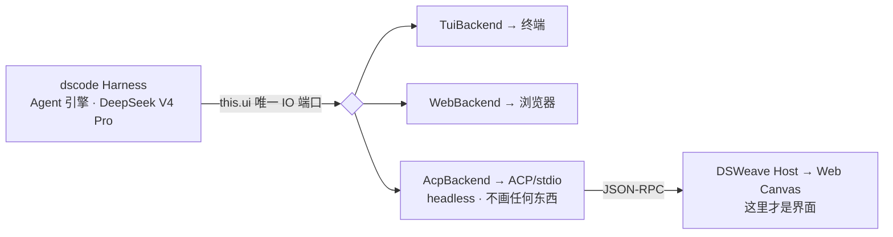
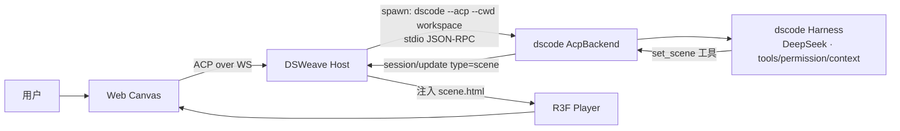

# DSWeave · Agent 接入设计（dscode）

> 文档版本：v0.1 ｜ 配套：`01-architecture.md`、`02-technical-design.md`、`03-implementation-plan.md`、`04-player.md`
> 主题：M4b 把**真实 Agent** 接进 DSWeave —— 复用自有的 **dscode**（DeepSeek V4 Pro 引擎），**不走 MCP**，保持现有 `web → Host(ACP) → Agent(stdio)` 拓扑不变。

---

## 1. 背景与约束

M4 的"真实 Agent"接入,有几条**已拍板的约束**:

1. **接入对象 = dscode**（`creativedswork/dscode@develop`，本机 `~/Workspace/DeepSeekSpace/dscode`），我们自己维护,可改其源码。
2. **不走 MCP**。dscode 本身是 MCP-first 的 host（它当 MCP client 挂外部工具）,但本次集成**不**采用"DSWeave 当 MCP server、dscode 连进来"的反向方案。
3. **dscode 仅作为 Agent 引擎**,**零界面**;所有 UI 归 DSWeave 的 Web Canvas。
4. **模型与 cwd 用 dscode 现成机制**,不另造配置表面。
5. 真实 LLM 实跑需要 `DEEPSEEK_API_KEY`（运行时由操作者提供）。

---

## 2. 核心结论：给 dscode 加一个 headless `AcpBackend`

dscode 的 `Harness.run(ui?: UiBackend)` 本就接受一个 backend：默认 `TuiBackend`（画终端）,`--web` 换 `WebUiBackend`（推 WebSocket）。

关键事实——dscode 把 **Agent 引擎的所有 IO 都从 `this.ui` 这一个口子走**（源码核对）：

| 行为 | 源码位置 | 经由 |
| --- | --- | --- |
| 权限请求 | `harness.ts:70` | `this.ui.getPromptPermission()` |
| thinking/text 流 | `harness.ts:1055/1058` | `this.ui.thinkingDelta / textDelta` |
| 工具调用起止 | `harness.ts:1064/1070` | `this.ui.toolStart / toolEnd` |
| 消息/处理生命周期 | `harness.ts:1090-1099` | `this.ui.startAssistantMessage / finishAssistantMessage / setProcessing` |
| 重试/错误/信息 | `harness.ts:214-271` 等 | `this.ui.addRetry / addError / addInfo` |

也就是说,`UiBackend` 名为"UI",**功能上是 Agent 引擎对外的唯一 IO 端口**。`TuiBackend`/`WebBackend` 只是这个端口的两个"渲染器"。

> **所以方案 = 加第三个"渲染器" `AcpBackend`,它渲染的目标是 ACP/stdio 字节流,不是屏幕。它一个像素都不画。界面 100% 是 DSWeave。**

### 为什么不绕开 backend 直接驱动 Harness？

理论上可调 `harness.promptAndSave()` 再自己监听 `agent` 原始事件。但 `Harness` 已把**事件绑定 + 权限路由 + 重试反馈**全接到 `this.ui`。走这个口子 = **零改动复用**；绕开 = 在 DSWeave 侧把 `harness.ts:1055-1167` 那套重新实现一遍,等于 fork dscode 核心。故选 `UiBackend` 接缝。

---

## 3. 端到端拓扑

ACP 链路与 M2/M3 完全一致；唯一新增是 Agent 通过工具产出 **SceneSpec**,经 `session/update` 的新变体回流 Host。

---

## 4. 模型与 cwd 设计（dscode 已现成）

dscode 已支持，DSWeave 只在 **spawn 配置块**里带 `{ cwd, env }` 即可,**无新配置表面**。

| 维度 | dscode 现状 | DSWeave 怎么用 |
| --- | --- | --- |
| **cwd** | `main.ts` 支持 `--cwd <dir>` → `loadConfig(cwd)` → 项目级 `.dscode/settings.json` + checkpoint 根 | spawn 时传 `--cwd <session workspace>`，即放 flow/assets/`scene.html` 的目录 |
| **模型** | `~/.dscode/config.json`（`/config` 写）+ env：`DEEPSEEK_API_KEY`/`AGENT_PROVIDER`/`AGENT_MODEL`/`AGENT_THINKING_LEVEL` | spawn 时把这些 env 透传进子进程；模型选择仍归 dscode |

约定：**dscode 的项目路径与 DSWeave 的 session workspace 指向同一目录**,使 dscode 的 fs 驱动、`@file`、DSWeave 的理解产物、Player 注入物共享同一相对路径基准。

---

## 5. 改动清单

### 5.1 dscode 侧（`~/Workspace/DeepSeekSpace/dscode`）

| 文件 | 改动 |
| --- | --- |
| `src/ui/acp-backend.ts`（新增） | 实现 `UiBackend`：stdin/stdout 上的 ACP JSON-RPC。收 `session/prompt` → `harness.promptAndSave()`；把 `textDelta/thinkingDelta/toolStart/toolEnd` 映射成 `session/update`；`getPromptPermission()` 发 `session/request_permission` 等决策；`waitForExit()` 在 stdin 关闭时退出。**不渲染任何界面。** |
| `src/drivers/set-scene.ts`（新增）+ `registry.ts` 注册 | **builtin driver `set_scene(spec)`**（与 `fs`/`shell` 同级,**非 MCP**）。模型调它提交 SceneSpec；用 SceneSpec zod schema 校验后,经 `session/update{type:'scene'}` 发回 Host。这是"Agent 只输出数据"的可靠落地。 |
| `src/core/main.ts` | 加 `--acp` 分支（对照现有 `--web`），选 `AcpBackend`。 |
| system prompt | 追加：产物是 SceneSpec,必须通过 `set_scene` 工具提交,不写代码。 |
| （可选）`UiBackend` 改名 | headless 现为一等场景,可把 `UiBackend` 改名 `AgentBackend`/`AgentIoPort`,接口不变,消除"必须是 GUI"的误解。 |

> `Harness` 核心、Agent loop、`run()` 签名**都不动**。

### 5.2 DSWeave 侧（本仓）

| 位置 | 改动 |
| --- | --- |
| `packages/host/agent-manager.ts` | 复用 `spawnStdioConnector` 槽；M4b 把目标设为 `node <dscode>/dist/dscode.mjs --acp --cwd <workspace>`,env 透传 key。 |
| `packages/host`（prompt 组装） | 把 `PromptInput`（graph + context + 注入的 understanding，M3 产物）拼成给 DeepSeek 的文本指令。 |
| `packages/protocol/messages.ts` | `SessionUpdate` 增 `{ type: 'scene'; spec: SceneSpec }` 变体；Host 收到即校验 + 注入 `scene.html` 推给 Player。 |

---

## 6. ACP ↔ dscode UiBackend 映射

| DSWeave ACP | dscode `UiBackend` 方法 | 方向 |
| --- | --- | --- |
| `session/prompt`（in） | `harness.promptAndSave(text, images)` | Host → Agent |
| `session/update {type:'log'\|'agent-text'}` | `textDelta` / `thinkingDelta` / `addInfo` | Agent → Host |
| `session/update {type:'tool-call'}` | `toolStart` / `toolEnd` | Agent → Host |
| `session/update {type:'scene'}` | `set_scene` driver 捕获 | Agent → Host |
| `session/request_permission` | `getPromptPermission()` | Agent → Host（等回复）|
| `PromptResult{stopReason}` | `setProcessing(false)` / `agent_end` | Agent → Host |

---

## 7. M4a / M4b 分阶段落地（一条龙、分步可验）

- **M4a（本仓，确定性，无 dscode、无 key）**：Player 渲染 + `scene.html` 注入 + **启发式 SceneSpec agent** 走现有 ACP 链路 → `m4:smoke` 绿。先把竖切跑通。
- **M4b（跨两仓）**：dscode 加 `AcpBackend` + `set_scene` driver + `--acp`；本仓加 spawn 契约 + prompt 组装 + `scene` 变体；把 spawn 目标从启发式换成 dscode。
  - 沙箱里可用 **Mock ↔ dscode 切换**证明"前端零改动"；
  - **真模型实跑**需操作者提供 `DEEPSEEK_API_KEY`。

---

## 8. 验收

- [ ] M4a：启发式 agent 产出合法 SceneSpec → Host 注入 → 自包含 3D HTML 跑得起来（`m4:smoke` 绿）。
- [ ] M4b 骨架：`dscode --acp` 能被 Host spawn、说 ACP、`set_scene` 工具产出经校验回流 Host；权限/日志/工具流在 Web Canvas 实时可见。
- [ ] 切换 Mock ↔ dscode，DSWeave 前端**零改代码**。
- [ ] 给定 `DEEPSEEK_API_KEY` 后真模型端到端产出 SceneSpec（运行时验收）。
- [ ] cwd：dscode 项目路径 = DSWeave session workspace；模型经 dscode config/env 配置生效。

---

## 9. 风险与备选

| 风险 | 应对 |
| --- | --- |
| SceneSpec 捕获不稳（模型不调工具） | 首选 `set_scene` builtin driver（强约束 + 校验 + 重试）；备选解析末条消息的 fenced JSON。 |
| dscode 的 `UiBackend` 后续 API 变动 | 我们自维护；`AcpBackend` 与 TUI/Web 同实现一套接口,随上游演进同步。 |
| 真 LLM 不可在沙箱实测 | 链路用 Mock↔dscode 切换证明可插拔；真模型留作运行时验收。 |
| dscode 自带 fs/bash 等工具越权 | 复用 dscode 权限层（`beforeToolCall`）+ DSWeave `request_permission` 审批；cwd 沙箱限定 workspace。 |
