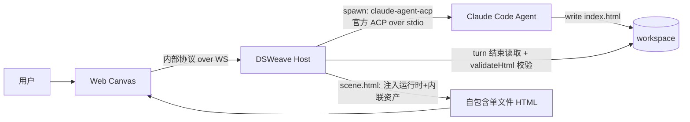
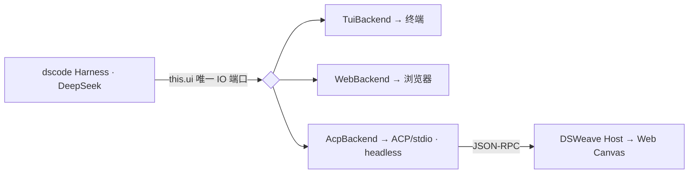
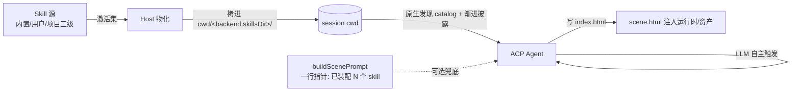
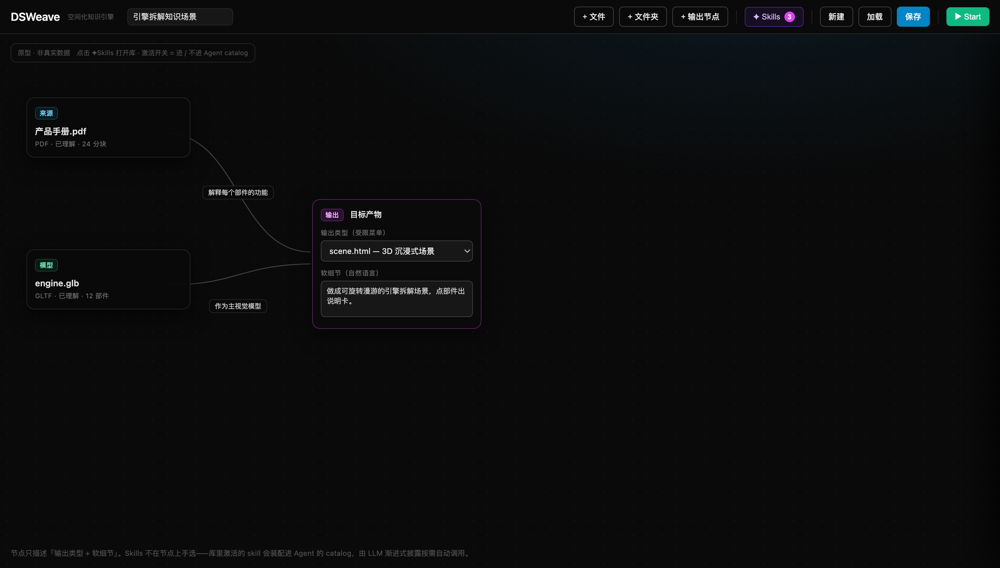
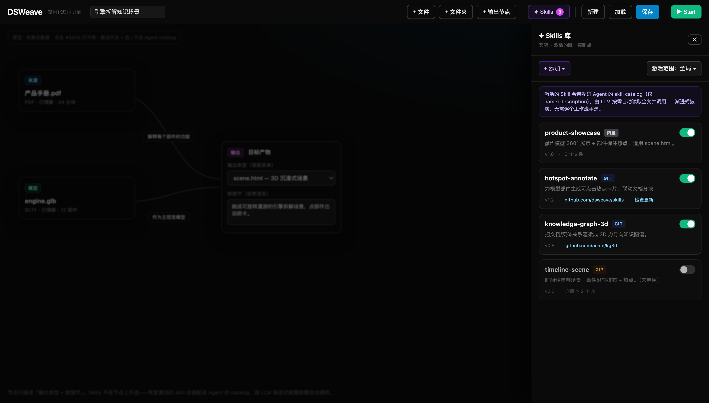
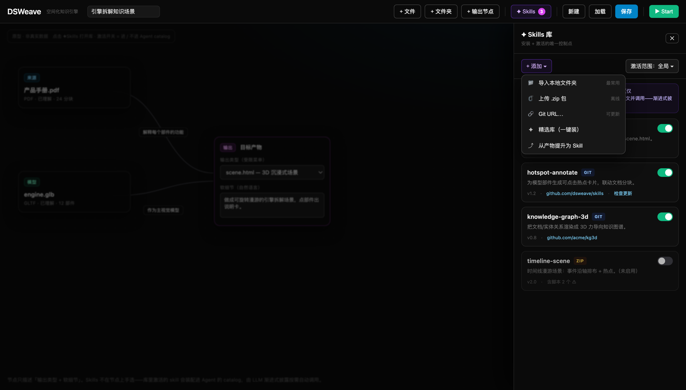
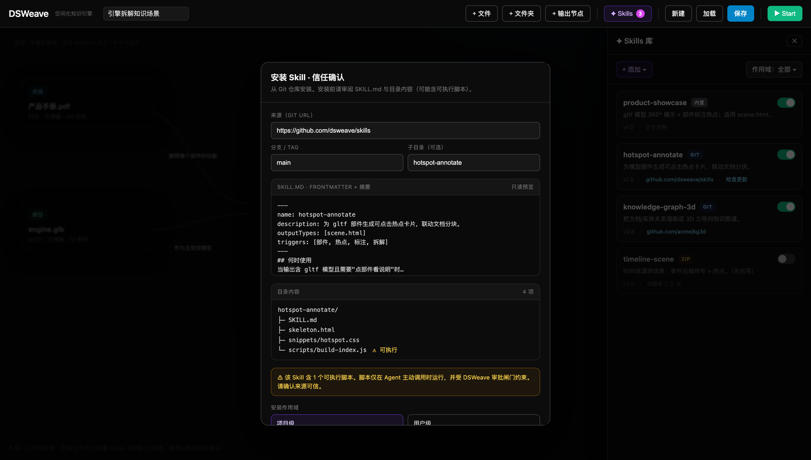

# DSWeave · Agent 接入设计

> 文档版本：v0.2 ｜ 配套：`01-architecture.md`、`02-technical-design.md`、`03-implementation-plan.md`、`04-player.md`
>
> **接入路线（已更新）**：
> - **M4**：通过 [`@agentclientprotocol/claude-agent-acp`](https://github.com/agentclientprotocol/claude-agent-acp) 接入 **Claude Code**（现成官方 ACP agent，走 stdio）。先把主竖切 + index.html 交付链路跑通。
> - **新增 ACP 后端 · Gemini CLI**：通过 Gemini CLI 原生的 [ACP 模式](https://geminicli.com/docs/cli/acp-mode/)（`gemini --acp`，同样说官方 ACP over stdio）接入。与 Claude 后端**完全同构、可热插拔**（`DSWEAVE_AGENT=gemini`），前端/内部协议/bridge/能力链路零改动。详见 §6。
> - **M6**：把自有的 **dscode**（DeepSeek V4 Pro）作为**内置 agent** 接入（headless `AcpBackend`，不走 MCP）。后置。

> **架构演进（2026-06）**：ACP 接入设计（官方 ACP/stdio、翻译收敛于内部 Agent、通用核心 + 薄后端、可插拔）保持不变；但 Agent 的交付物已从 scene.spec.json（SceneSpec 数据）改为自包含 index.html。Host turn 结束读 index.html → 纯文本校验回灌重试 → scene.html 能力注入 model-viewer 运行时 + 内联 asset:// 资产。@dsweave/player 包与 SceneSpec 契约已移除。下文涉及交付物的描述据此更新。

---

## 1. 接入策略

Agent 始终是**可插拔**的：`web → Host(内部协议) → Agent(ACP over stdio)`。Host 在 stdio 边界说 **官方 ACP**（`@agentclientprotocol/sdk`），不同 Agent 实现只要是合规 ACP agent 即可热插拔，DSWeave 前端零改动。

| 阶段 | Agent | 形态 | 价值 |
| --- | --- | --- | --- |
| M2/M3 | Mock | 进程内 / stdio | 验证可插拔抽象、文件理解链路 |
| **M4** | **Claude Code** | `claude-agent-acp`（外部 npm，stdio） | 不自研 agent 即可跑通真实竖切 + index.html 交付 |
| **+** | **Gemini CLI** | `gemini --acp`（外部 CLI，stdio，官方 ACP） | 第二个现成官方 ACP agent，证明「换后端=换命令」 |
| M6 | dscode | 内置 headless `AcpBackend` | 自有引擎、DeepSeek、可深度定制 |

> 先接 Claude Code 的理由：它是**现成、稳定的官方 ACP agent**，让我们把精力集中在「Agent 写 index.html + 纯文本校验回灌 + scene.html 注入 model-viewer 运行时 + 产物交付」这条主竖切上，而不是同时调试一个新 agent 引擎。dscode 内置接入的设计已成熟（见 §4），但可后置到竖切验证之后。

---

## 2. M4 · 接入 Claude Code（`claude-agent-acp`）

### 2.1 事实（已核对 npm，2026-06）

> 注：`@zed-industries/*` 这套 ACP 包已整体**重命名**为 `@agentclientprotocol/*`（旧名仍可用但标 deprecated）。计划文档原本的包名即新名，采用之。

| 项 | 值 |
| --- | --- |
| adapter npm 包 | **`@agentclientprotocol/claude-agent-acp@0.50.0`**（Apache-2.0；旧名 `@zed-industries/claude-code-acp@0.16.2` 已 deprecated） |
| 启动 | bin `claude-agent-acp`；`npx -y @agentclientprotocol/claude-agent-acp`，stdio |
| 运行时 | Node ≥ 20（本机 v22 ✅） |
| 协议 SDK | 官方 **`@agentclientprotocol/sdk@0.29.0`**（`PROTOCOL_VERSION = 1`；`ClientSideConnection` + `ndJsonStream`；旧名 `@zed-industries/agent-client-protocol@0.4.5` 已 deprecated，API 兼容） |
| 底层 | Claude Code CLI（本机 `claude` v2.1.185） |
| 鉴权 | 三选一：① `ANTHROPIC_API_KEY`；② 本机 Claude Code 登录态（`~/.claude.json` / Keychain）；③ **DeepSeek 网关**（`~/.bash_profile` 设 `ANTHROPIC_BASE_URL`/`ANTHROPIC_AUTH_TOKEN`）。**本仓阶段 A 实测走 ③（DeepSeek `deepseek-v4-pro`）通过**。Host spawn 时透传 `process.env`，子进程继承。 |
| 能力 | 工具调用 + 权限请求（`session/request_permission`）、`fs/read_text_file`、`fs/write_text_file`、terminals、session/update 流 |

### 2.2 拓扑



### 2.3 关键决策一：stdio 边界说「官方 ACP」

`claude-agent-acp` 走官方 ACP 线协议,而我们 `packages/protocol` 是**自研 ACP 形态**（方法名/语义对齐,但非官方线类型）。因此：

- Host 在 stdio 边界**采用 `@agentclientprotocol/sdk` 作为 ACP client** 来 spawn 并对接 `claude-agent-acp`（`packages/host/src/claude/acp-client.ts`）。
- **翻译收敛在一个「Claude 驱动的内部 Agent」里**（`packages/host/src/claude/claude-agent.ts`）：它实现与启发式 agent **完全相同的内部契约**（`AgentSideConnection`：`onPrompt` + `sessionUpdate` + `requestPermission` + `invokeCapability`），但 `onPrompt` 内部经官方 ACP 驱动 `claude-agent-acp`。内部 `session/prompt` → 官方 prompt turn；官方 `session/update`（agent_message_chunk / tool_call）→ 内部 `SessionUpdate`；官方 permission 请求 → 内部 `request_permission`。
- 因此 **`bridge.ts`、内部协议、前端、`CapabilityRegistry` 全部零改动**——仅 Agent 实现从启发式换成 Claude。这正是 `messages.ts` 注释预留的演进点（"M4 接真实 Agent 时，可在 stdio 边界换上官方 SDK 而不影响上层"）。

### 2.4 关键决策二：Claude 如何产出 index.html

Claude 是通用编码 agent,天然擅长"写文件"。沿用「写文件」收口：

| 方案 | 机制 | 取舍 |
| --- | --- | --- |
| **A（首选）写文件** | 系统指令/`CLAUDE.md` 约束：把自包含 HTML 写到 `<cwd>/index.html`（用 `asset://{nodeId}` 引用源文件、用 `<model-viewer>` 预览模型）；Host 在 turn 结束读取 + `validateHtml` 纯文本校验 + 经 `scene.html` 能力注入运行时与内联资产 | 零 MCP；契合编码 agent 强项（写文件）；权限流天然覆盖写操作；可重试 |
| B（备选）Client MCP tool | 用 `claude-agent-acp` 支持的 Client MCP servers 暴露结构化提交工具 | 更结构化,但引入 MCP 表面 |

> 默认走 **A**。系统指令明确：你的唯一交付物是自包含的 `<cwd>/index.html`（非空 / 无外链 `script`·`link` / `asset://` 仅引用 models∪images），不要写其它运行时打包代码（model-viewer 运行时由 `scene.html` 能力注入）。Host `validateHtml` 校验失败 → 把错误回灌让 Claude 修正（重试）。

### 2.5 cwd / 鉴权 handshake

| 维度 | 机制 |
| --- | --- |
| **cwd** | 官方 ACP `session/new` 的 `workingDir` → 指向 DSWeave session workspace（flow/assets/`index.html`）；Claude 的文件工具据此读写 |
| **鉴权** | Host spawn 时透传 `ANTHROPIC_API_KEY`（操作者提供）；或复用本机 Claude Code 登录态 |
| **模型** | 由 Claude Agent SDK / 环境决定（如 `ANTHROPIC_MODEL`），Host 不另造表面 |

### 2.6 改动清单（本仓，已落地）

| 位置 | 改动 |
| --- | --- |
| `packages/host`（依赖） | `@agentclientprotocol/sdk` 作为 stdio 边界的 ACP client |
| `packages/host/src/claude/acp-client.ts`（新增） | `ClaudeAcpSession`：spawn `claude-agent-acp` + `ClientSideConnection`/`ndJsonStream`；`init(cwd)` → `initialize`/`session/new`；`prompt(text)` 一轮 turn；实现 Client 侧 `requestPermission`/`fs`。adapter 命令可经 `CLAUDE_ACP_CMD`/`CLAUDE_ACP_ARGS` 覆盖（测试用）。 |
| `packages/host/src/claude/claude-agent.ts`（新增） | `createClaudeAgent`：Claude 驱动的内部 `AgentSideConnection`。`onPrompt` 编 prompt → 驱动 ACP → 读 `<cwd>/index.html` → `validateHtml` 纯文本校验（失败回灌重试）→ `invokeCapability('scene.html', { html })`；流式 update/permission 透传前端。 |
| `packages/host/src/claude/prompt.ts`（新增） | 把图 + 理解 + 上下文 + 输出编成系统指令 + 自由 HTML 产出指令 + 机器可读 `<DSWEAVE_CONTEXT>`（真实分块文本 + `knownNodeIds=models∪images`），约束"唯一交付物是自包含 `index.html`、用 `asset://{nodeId}` 引用、不写外链代码"。 |
| `packages/host/src/agent-manager.ts` | 新增 `inProcessClaudeAgentConnector`（进程内 memory transport + `createClaudeAgent`）。 |
| `packages/host/src/index.ts` / `main.ts` | `agentKind: 'mock'\|'scene'\|'claude'` + `connectorForKind`；`DSWEAVE_AGENT=claude` 选 Claude。 |
| `packages/host/src/claude/fake-adapter.ts`（新增） | 测试用「假 ACP Agent」（说官方 ACP，写 `index.html`），供 `freeform:smoke` 在沙箱内验证全链路。 |
| `packages/host/bridge.ts` | **零改动**（翻译收敛在 Claude agent 内）。 |
| `packages/core` | `HtmlPageInput { html }` 协议输入 + `validateHtml` 纯文本校验（旧 `SceneHtmlInput{spec}` / `SceneSpec` 类型/zod 已移除，`@dsweave/player` 包已删）。 |

### 2.7 验收

- [x] **阶段 A 探针**（`pnpm m4b:probe`，见 `packages/host/src/m4b-probe.ts`）：Host 用官方 ACP SDK（`@agentclientprotocol/sdk`）spawn `@agentclientprotocol/claude-agent-acp`。**已实测（2026-06-24）**：`spawn → initialize(protocolVersion=1) → session/new` 全通过，**证明链路 + 鉴权（读 `~/.claude/settings.json` 的 key）正常**；`session/prompt` 因账户 `Credit balance is too low` 失败 → 探针识别为计费问题并打印 `M4B_HANDSHAKE_OK ⚠️`。补余额/换有额度 key 后即可走完整 turn（Claude 经 `fs/write_text_file` 写哨兵文件 → `M4B_PROBE_OK`）。
- [x] **阶段 A 探针完整通过（2026-06-24）**：经本机 DeepSeek 网关（`~/.bash_profile` 的 `ANTHROPIC_BASE_URL`/`ANTHROPIC_AUTH_TOKEN`）真调模型，`spawn → initialize → session/new → session/prompt`（Claude 调 `Write` 工具、走 ACP 权限请求）→ 写哨兵文件 → `end_turn` 全通过，`M4B_PROBE_OK ✅`。
- [x] **阶段 B 全链路（沙箱内，`pnpm freeform:smoke`）✅**（旧 `m4b:smoke` 已删）：用「假 ACP Agent」替身（说官方 ACP，写 `index.html`）验证 Host 官方 ACP client + index.html 收口 + `validateHtml` 纯文本校验 + `scene.html` 能力出物（注入 model-viewer 运行时 + 内联 asset:// 资产）+ 权限翻译 + 产物缓存全通过，且 `bridge.ts`/内部协议/前端零改动。
- [x] index.html `validateHtml` 校验失败可回灌重试直至合法（`claude-agent.ts` 内 `maxRetries`，错误经 `buildRetryPrompt` 回灌）。
- [x] 切换 Mock ↔ scene ↔ Claude（`DSWEAVE_AGENT` / `agentKind`），DSWeave 前端零改代码。
- [x] **真模型竖切（操作者本机）✅**：`DSWEAVE_AGENT=claude pnpm dev:host` + `pnpm dev:web`，拖入 gltf+文档、写关系、选 `scene.html` → Claude 经官方 ACP 产出自包含 `index.html` → Host `validateHtml` 校验、`scene.html` 注入运行时与内联资产 → **自包含单文件 3D HTML**。操作者本机实测通过（本机 Claude 登录态 / DeepSeek 网关；沙箱内不可联网实测）。

---

## 3. M4a / M4b（M4 内部分步）

- **M4a（确定性、无 LLM）✅ 已落地**：`scene.html` 注入 + **启发式 agent** 走现有内部链路 → `pnpm m4:smoke` 绿。不依赖外网/key。
  - Agent 经新增协议方法 `capability/invoke` 调用 Host `scene.html` 能力（Bridge 在 agent→host 方向拦截）；产物内容寻址落盘 + HTTP 静态服务预览；审批走 `request_permission` + Web `PermissionDialog`。
  - 收口选择：M4a 采用 **`capability/invoke`（结构化）** 而非「写 `index.html` 文件」——因启发式 agent 在进程内、产物直接可达；M4b 接 Claude Code 时改走「写文件 + turn 结束读取校验」（§2.4 方案 A），两者经同一 `CapabilityRegistry` 收敛到 `scene.html` 能力。
- **M4b（接 Claude Code）✅ 已落地**：
  - **阶段 A（探针）✅**：`pnpm m4b:probe`（`packages/host/src/m4b-probe.ts`）独立验证 Host↔`claude-agent-acp` 官方 ACP 握手 + 写文件 prompt turn，不碰 DSWeave 业务。**2026-06-24 经 DeepSeek 网关真调通过 `M4B_PROBE_OK`**。
  - **阶段 B（完整接入）✅**：翻译收敛在 **Claude 驱动的内部 Agent**（`packages/host/src/claude/`，见 §2.3/§2.6），`bridge.ts`/内部协议零改动；turn 结束读取 `index.html` → `validateHtml` 纯文本校验（失败回灌重试）→ `scene.html` 注入。`inProcessClaudeAgentConnector` spawn `claude-agent-acp`（adapter 命令可覆盖）。
  - **阶段 B 沙箱验证**：`pnpm freeform:smoke`（用假 ACP 替身写 `index.html` 跑通全链路；旧 `m4b:smoke` 已删）以假 ACP 替身跑通除「真模型」外的全部代码路径；真模型竖切由操作者本机 `DSWEAVE_AGENT=claude` 运行。

---

## 4. M6 · 内置 dscode（后置）

> 目标：把自有的 **dscode**（`creativedswork/dscode`，本机 `~/Workspace/DeepSeekSpace/dscode`，DeepSeek V4 Pro）作为**内置 agent**。**不走 MCP**。竖切（M4）验证后再做。

### 4.1 结论：给 dscode 加 headless `AcpBackend`

dscode 的 `Harness.run(ui?: UiBackend)` 接受一个 backend（默认 `TuiBackend`，`--web` 换 `WebUiBackend`）。dscode 把 **Agent 引擎的所有 IO 都从 `this.ui` 这一个口子走**（源码核对）：

| 行为 | 源码位置 | 经由 |
| --- | --- | --- |
| 权限请求 | `harness.ts:70` | `this.ui.getPromptPermission()` |
| thinking/text 流 | `harness.ts:1055/1058` | `this.ui.thinkingDelta / textDelta` |
| 工具调用起止 | `harness.ts:1064/1070` | `this.ui.toolStart / toolEnd` |
| 消息/处理生命周期 | `harness.ts:1090-1099` | `startAssistantMessage / finishAssistantMessage / setProcessing` |

即 `UiBackend` 名为 UI，**功能上是 Agent 引擎对外的唯一 IO 端口**。`AcpBackend` = 这个端口的第三个"渲染器",渲染目标是 ACP/stdio 字节流,**不画任何界面;界面 100% 归 DSWeave**。走此接缝 = 零改动复用（事件绑定/权限/重试都已接在 `this.ui` 上）；绕开则需在 DSWeave 侧重实现 `harness.ts:1055-1167`,等于 fork。



### 4.2 模型与 cwd（dscode 已现成）

| 维度 | dscode 现状 | 用法 |
| --- | --- | --- |
| cwd | `main.ts` 支持 `--cwd <dir>` → `loadConfig(cwd)` | spawn 传 `--cwd <workspace>` |
| 模型 | `~/.dscode/config.json` + env（`DEEPSEEK_API_KEY`/`AGENT_PROVIDER`/`AGENT_MODEL`） | spawn 透传 env，模型选择归 dscode |

### 4.3 改动清单（dscode 侧）

| 文件 | 改动 |
| --- | --- |
| `src/ui/acp-backend.ts`（新增） | 实现 `UiBackend`：stdio 上说 ACP；`session/prompt`→`promptAndSave`；事件→`session/update`；`getPromptPermission`→`request_permission`。零界面。 |
| `src/drivers/set-scene.ts`（新增）+ `registry.ts` | builtin driver `set_scene(spec)`（**非 MCP**），校验后经 `session/update{type:'scene'}` 回流 Host。 |
| `src/core/main.ts` | 加 `--acp` 分支选 `AcpBackend`。 |
| system prompt | 产物是 SceneSpec，必须经 `set_scene` 提交，不写代码。 |
| （可选）`UiBackend` 改名 | → `AgentBackend`/`AgentIoPort`，消除"必须是 GUI"误解。 |

> 本节 `set_scene` / `SceneSpec` 方案为历史设计。**（已演进：交付物改为写 `index.html`，`set_scene`/`SceneSpec` 方案作废，dscode 接入时对齐写文件——产物是自包含 `index.html`，由 Host `validateHtml` 校验后经 `scene.html` 能力注入运行时与内联资产。）**

---

## 5. 风险与备选

| 风险 | 应对 |
| --- | --- |
| 内部协议 ↔ 官方 ACP 映射有缺口 | 先覆盖 prompt/update/permission 子集；bridge 单测；不支持的官方变体降级为日志 |
| Claude/Gemini 不稳定产出合法/自包含 HTML | 强系统约束 + `validateHtml` 纯文本校验回灌重试；备选 Client MCP 结构化提交工具 |
| 真 LLM 不可在沙箱实测 | M4a 启发式跑绿；Mock↔Claude↔Gemini 切换证明可插拔；真模型留运行时验收 |
| Agent 自带 fs/bash/terminal 越权 | ACP permission 请求 → DSWeave 审批；`cwd` 沙箱限定 workspace |
| `claude-agent-acp` / `gemini` 版本演进 | 锁版本 + 关注 ACP SDK 兼容；Agent 可插拔，必要时回退 Mock |

---

## 6. 新增 ACP 后端 · Gemini CLI（`gemini --acp`）

> ⚠️ **状态更新（2026-06）**：**Gemini CLI 已于 2026-06-18 sunset，由 Antigravity CLI（`agy`）取代**；扩展经 `agy plugin import gemini` 迁移，workspace skills 从 `.gemini/skills/` 迁至开放标准 `.agents/skills/`，`GEMINI.md` 上下文文件仍兼容。本节「换后端=换一条 spawn 命令」的结论**依然成立**（Antigravity 同样说官方 ACP/stdio），落地时把 spawn 命令由 `gemini --acp` 换成对应的 `agy` ACP 命令、并据其文档确认参数即可；§7 的 skill 目录亦优先采用 `.agents/skills/`。本节其余内容作为历史设计保留，接入前以 Antigravity 最新文档为准。

### 6.1 结论：换后端 = 换一条 spawn 命令

Gemini CLI **原生支持官方 ACP**（[ACP Mode](https://geminicli.com/docs/cli/acp-mode/)：`gemini --acp`，JSON-RPC 2.0 over stdio，`PROTOCOL_VERSION = 1`，含 `initialize` / `session/new` / `prompt` / `request_permission` / fs 代理）。这与 Claude Code（`claude-agent-acp`）说的是**同一套官方 ACP**。因此 §2.3 的关键决策一（「stdio 边界说官方 ACP，翻译收敛在一个内部 Agent」）天然复用——新增 Gemini 后端**不需要任何新的协议翻译**，只是把 spawn 的命令从 `npx -y @agentclientprotocol/claude-agent-acp` 换成 `gemini --acp`。

```mermaid
graph LR
  H[DSWeave Host] -->|spawn: claude-agent-acp<br/>官方 ACP / stdio| C[Claude Code]
  H -->|spawn: gemini --acp<br/>官方 ACP / stdio| G[Gemini CLI]
  C -.write index.html.-> FS[(workspace)]
  G -.write index.html.-> FS
  H -->|turn 结束读取 + validateHtml + scene.html 注入| P[自包含单文件 HTML]
```

### 6.2 落地形态：抽出通用核心 + 两个薄后端

为消除重复，把原 `claude-agent.ts` 的编排（编 prompt → 驱动 ACP → 读 `index.html` → `validateHtml` 校验回灌重试 → `invokeCapability('scene.html', { html })`）抽到**通用核心** `acp/acp-agent.ts`，由一个 `AcpBackendSpec`（`label` / `slug` / `resolveCommand`）特化。Claude 与 Gemini 各自只是一个**薄包装**：

| 位置 | 改动 |
| --- | --- |
| `packages/host/src/acp/acp-agent.ts`（新增） | 通用「ACP 驱动的内部 Agent」核心：`createAcpAgent(transport, backend, options)`。承载全部编排，与具体模型无关。 |
| `packages/host/src/claude/acp-client.ts` | 已有的 `ClaudeAcpSession`（adapter 命令可配）天生通用；新增中立别名 `AcpSession` / `AcpSessionOptions`，以及 `defaultGeminiAdapterCommand`（默认 `gemini --acp`，可经 `GEMINI_ACP_CMD` / `GEMINI_ACP_ARGS` 覆盖）。 |
| `packages/host/src/claude/prompt.ts` | 自由 HTML 产出 prompt 与模型无关；新增中立别名 `buildScenePrompt` / `SceneContext`，Claude 与 Gemini 共用。 |
| `packages/host/src/claude/claude-agent.ts` | 改为通用核心的薄包装（`CLAUDE_BACKEND`）。行为不变。 |
| `packages/host/src/gemini/gemini-agent.ts`（新增） | `createGeminiAgent`：通用核心的薄包装（`GEMINI_BACKEND`，`resolveCommand = defaultGeminiAdapterCommand`）。 |
| `packages/host/src/agent-manager.ts` | 新增 `inProcessGeminiAgentConnector`（进程内 memory transport + `createGeminiAgent`）。 |
| `packages/host/src/index.ts` / `main.ts` | `AgentKind` 增加 `'gemini'`；`connectorForKind('gemini')`；`DSWEAVE_AGENT=gemini` 选 Gemini。 |
| `packages/host/src/gemini-probe.ts`（新增） | 与 `m4b-probe` 同构的探针（验证 ACP 握手 + 写文件 turn）。沙箱端到端烟测统一收敛到 `pnpm freeform:smoke`（旧 `gemini-smoke` 已删；复用 agent 中立的 `claude/fake-adapter.js` 假替身写 `index.html`）。 |
| `bridge.ts` / 内部协议 / 前端 / `CapabilityRegistry` | **零改动**。 |

### 6.3 cwd / 鉴权

| 维度 | 机制 |
| --- | --- |
| **cwd** | 同 Claude：官方 ACP `session/new` 的 `cwd` → 指向 session workspace（`index.html` 落此），Gemini 的 fs 工具据此读写；Client 侧 `fs/read|write_text_file` 限定在 workspace（路径越界拒绝）。 |
| **鉴权** | Host spawn 时透传 `process.env`，Gemini CLI 自行读取本机登录态 / `GEMINI_API_KEY` / `GOOGLE_API_KEY`（或 Vertex 凭据）。Host 不另造鉴权表面。 |
| **adapter 覆盖** | `GEMINI_ACP_CMD` / `GEMINI_ACP_ARGS`（测试可指向假替身或自定义二进制）。 |

### 6.4 验收

- [x] **沙箱全链路**（`pnpm freeform:smoke`）（旧 `gemini:smoke` 已删）：以 agent 中立的假 ACP 替身（说官方 ACP，写 `index.html`）跑通后端的官方 ACP client + `index.html` 收口 + `validateHtml` 纯文本校验 + `scene.html` 能力出物（注入 model-viewer 运行时 + 内联 asset:// 资产）+ 权限翻译 + 产物缓存；`bridge.ts`/内部协议/前端零改动。
- [x] 切换 Mock ↔ scene ↔ Claude ↔ **Gemini**（`DSWEAVE_AGENT` / `connectorForKind`），DSWeave 前端零改代码。
- [ ] **阶段 A 探针**（`pnpm gemini:probe`）：Host 用官方 ACP SDK spawn `gemini --acp`，`spawn → initialize → session/new → session/prompt`（Gemini 经 fs 工具写哨兵文件）。需操作者本机已安装并登录 Gemini CLI（沙箱内不可联网实测，留运行时验收）。
- [ ] **真模型竖切（操作者本机）**：`DSWEAVE_AGENT=gemini pnpm dev:host` + `pnpm dev:web`，拖入 gltf+文档 → Gemini 经官方 ACP 产出自包含 `index.html` → Host `validateHtml` 校验、`scene.html` 注入 → 自包含单文件 3D HTML。

---

## 7. Skills · 给 Agent 注入可复用产出配方（设计中）

> 文档版本：v0.3 新增 ｜ 配套原型：`docs/prototypes/skills-ui.prototype.html`（自包含可双击）｜ 探针：`pnpm skills:probe`

### 7.0 定位：Skill = 产出配方 + 领域知识包，**不是新工具**

DSWeave 的 Agent 已收口到「写 `index.html`」这一个交付物（§2.4 方案 A），且坚持「前端 / `bridge.ts` / 内部协议 / `CapabilityRegistry` 零改动」。因此 Skill **不做成新的工具/动词**（那会重新引入被刻意避开的 MCP 表面），而是**可复用的「怎么把某类知识编排成某种 3D/HTML 场景」的 know-how**——模板 prompt 片段 + 参考骨架 + 素材 + 触发条件。这与 Claude / Gemini Agent Skills（`SKILL.md` + frontmatter `description` + 渐进披露）哲学一致，且天然 **model-agnostic**（Claude / Gemini / dscode 通吃）。

示例：`knowledge-graph-3d`（关系→3D 力导向图）、`timeline-scene`（时间线漫游）、`product-showcase`（gltf 360° + 部件热点）、`report-academic`（`report.html` 学术排版）。

### 7.1 单一控制点：库管理 + 激活（不做 per-output 手选，也不做 Host 自动路由）

Agent Skills 本就是 **model-invoked**——所有激活的 skill 默认进入 Agent 的 skill catalog（仅 name+description），LLM 按 `description` **自主触发**，触发时才 `fs/read` 读全文。这就是渐进式披露。因此：

- ❌ **不做 per-output 手选**：让用户在输出节点上再挑一遍 skill，是替 LLM 做它本职的事，冗余且违背「用户只做三件事」。
- ❌ **不做 Host 关键词自动路由**：LLM 自己就是路由器，Host 再加一层关键词匹配是多余中间层。
- ✅ **唯一控制点 = 库管理里的「激活/停用」开关**。

| 维度 | 设计 |
| --- | --- |
| **控制点** | 顶栏 `✦ Skills` → 抽屉：安装 / **激活·停用** / 删除 / 更新（角标=已激活数） |
| **激活语义** | 激活 = Host 把该 skill **物化进 session cwd**（→ 进 catalog）；停用 = 不物化 |
| **作用域** | **全局激活为默认**（用户级偏好，所有 flow 共享）+ `.flow.json` **可选覆盖**（重度用户精确控制） |
| **prompt** | **不塞 skill 正文**；最多保留一行指针「已装配 N 个 skill」，探针证明原生发现成立后此行亦可省 |
| **Host 新表面** | 仅库管理（安装/激活/删除）需 `skills/*` 协议方法；激活集→物化→产出链路**零协议**，复用 §2.4「写文件」收口与 cwd 沙箱 |

> 关键校正：**激活 ≠ 把 skill 正文写进 prompt**。若把全文灌进 prompt，既 token 爆炸又恰好**反**了渐进式披露（把"按需才读的全文"提前全给了）。正确做法是物化进 cwd 让 agent 原生发现，catalog 只含 frontmatter。

### 7.2 Skill 解剖与作用域

```
skills/knowledge-graph-3d/
├─ SKILL.md         # frontmatter: id/name/description/outputTypes/triggers；正文: 怎么做
├─ skeleton.html    # 可选：参考骨架，Agent 按需读
├─ snippets/        # 可选：可复用 <script>/<style> 片段
└─ assets/          # 可选：素材（HDR/图标 sprite/字体子集）
```

`SKILL.md` frontmatter 约定：`name`、`description`（**最关键**——LLM 据此自主决定何时触发，写清触发条件）、`outputTypes: [scene.html]`（与 `capabilities/output-types.ts` 对齐）。`description` 写得越具体，LLM 触发越准——这取代了任何 Host 侧路由。

**三级作用域合并**（仿 Claude/Gemini）：内置（`packages/host/skills/`） < 用户级（`~/.dsweave/skills/`） < 项目级（`.dsweave/skills/`，**默认安装到此**，随仓库走、团队共享）。同 id 高优先级覆盖。

### 7.3 注入接缝：复用两个现成口子 + `skillsDir` per-backend



1. **接缝② cwd 物化（主路径）**：在 `acp/acp-agent.ts` 建 cwd 之后、`session.init` 之前，把**激活集**拷进 `cwd/<backend.skillsDir>/<id>/`，复用真实编码 agent 的**原生发现 + 渐进披露**（启动只读 frontmatter 建 catalog，LLM 触发时才经 `fs/read_text_file` 读全文）。
2. **接缝① Prompt 层（可选兜底）**：`SceneContext` 增 `skills` 字段；`buildScenePrompt` 至多追加**一行指针**（"本任务已装配 N 个 skill，按需运用"）——**不重复塞正文**，避免与 agent 原生 catalog 双重注入。探针证明原生发现成立后此行可省。
3. **接缝③ Skill 资产内联（后置）**：素材走 `scene.html` 内联管线，命名空间 `asset://skill:<id>/<file>`；需扩展 `validateHtml` 白名单与 `scene-html.ts`（唯一需碰能力实现处）。

`AcpBackendSpec` 增加 `skillsDir`（per-backend，因各家约定不同，不可写死）：

| 后端 | `skillsDir` | 用户级 |
| --- | --- | --- |
| Claude（`claude-agent-acp`） | `.claude/skills` | `~/.claude/skills` |
| Gemini / Antigravity | `.agents/skills`（开放标准，优先）或 `.gemini/skills` | `~/.agents/skills` |
| dscode（内置） | 自定（建议直接采 `.agents/skills`） | — |

### 7.4 发现机制核对与探针（决定「纯目录」vs「目录+指针」）

已核对（2026-06）：

- **Claude Agent SDK**（`claude-agent-acp` 底层）在**省略 `settingSources` 时默认加载 user+project**，即默认扫 `cwd/.claude/skills/`（及父目录到 repo root）。⇒ 纯目录方案**理论成立**。
- 兜底：adapter PR #406 起支持 `session/new` 的 `_meta.additionalRoots` → 映射到 Claude `additionalDirectories`，可**显式注入** skill 目录根，不依赖 cwd 推断。
- ⚠️ **Gemini CLI 已于 2026-06-18 sunset → Antigravity（`agy`）**，skills 迁至 `.agents/skills/`；§6 的 Gemini 接入需另行评估。

**探针 `pnpm skills:probe`**（`packages/host/src/skills-probe.ts`，沙箱内不可联网实测，本机跑）：在临时 cwd 写 `.claude/skills/dsweave-probe/SKILL.md`，口令 nonce **只写进 SKILL.md、绝不进 prompt**；prompt 仅引导「能看到 dsweave-probe 技能就用它并回它给的口令，否则回 NO_SKILL」。判定：

- 回复含 nonce → `SKILLS_PROBE_OK ✅` 原生发现成立 → 走**纯目录**（+ 一行指针）。
- 回复 `NO_SKILL` → `SKILLS_PROBE_NEGATIVE ❌` → 改用 `SKILLS_PROBE_ROOTS=1`（验证 `_meta.additionalRoots` 兜底）或「目录 + prompt 指针」。
- 余额不足 → `INCONCLUSIVE ⚠️`（同 m4b-probe 计费降级语义）。

### 7.5 安装来源矩阵与信任流（A 层）

| 来源 | 机制 | 取舍 |
| --- | --- | --- |
| **导入本地文件夹**（首推） | 复用现有 `webkitdirectory`（`Toolbar` 的 `+文件夹`） | 零新轮子；开发期最常用 |
| **上传 .zip** | Host 解压到作用域目录 | 离线分发 |
| **Git URL**（带 ref / 子目录） | Host `git clone`（联网 → 走 `request_permission`），记录 repo+ref 以「检查更新」 | 可更新、版本化、协作 |
| **精选库一键装** | 内置精选 skill 清单 | 降门槛 |
| **从产物提升为 Skill** | 把这次的好产出抽象成 skill | 呼应「产物提升为 source 节点」闭环，差异化亮点 |

**信任流（zip/git 必经）**：安装前弹预览 = `SKILL.md` frontmatter + 目录清单（标红可执行脚本）+ 安全提示 + 作用域单选（默认项目级）。脚本仅在 Agent 主动调用时运行且受审批闸门约束。原则：把 skill 当依赖——装前读 `SKILL.md`、pin 版本、优先项目级限制影响面。

### 7.6 协议方法（仅库管理新增；激活→产出链路零协议）

| 方法 | 方向 | 语义 |
| --- | --- | --- |
| `skills/list` | web → Host | 列出三级作用域已发现 skill（含来源/版本/激活态） |
| `skills/install` | web → Host | 安装（source: folder/zip/git/registry/promote）+ 信任确认结果 + 作用域；git 触发 `request_permission`（网络） |
| `skills/setActive` | web → Host | 激活/停用某 skill（含范围：全局 / 当前 flow） |
| `skills/remove` | web → Host | 删除某 skill |

> 激活集落地：全局激活存用户级偏好；`.flow.json` 可记 `activeSkills` 覆盖集。运行时由 Host 据激活集物化进 cwd，**不新增产出侧协议**。

### 7.7 UI（贴合现有深色主题，见原型）

- **顶栏**：`Toolbar` 在 `+ 输出节点` 旁加 `✦ Skills`（角标=**已激活数**）→ 打开右侧抽屉（复用 `Inspector` 浮层风格）。
- **抽屉（唯一控制点）**：副标题「安装 + 激活的唯一控制点」；`+ 添加 ▾`（5 来源）+ 「激活范围：全局 ▾」+ 紫色说明条（激活=进 catalog，LLM 渐进披露自动调用）+ skill 卡片（名称/来源徽标/描述/版本/**激活开关**/检查更新）。
- **安装弹窗**：Git URL + ref + 子目录 + `SKILL.md` 只读预览 + 目录清单（脚本告警）+ 作用域单选（默认项目级）。
- **输出节点**：**保持极简**，只有「输出类型 + 软细节」，**不放 skill 预选**——skill 由库激活后自动装配，LLM 自主选用。
- **运行时反馈**：执行时复用 `session/update`，log 打「已触发 Skill: x」，agent 读 `SKILL.md` 经 `onToolCall → tool-call` 卡片展示——即"本次实际用了哪些 skill"，比预选更有信息量。

原型四态截图：






### 7.8 渐进落地

| 阶段 | 内容 | 验收 |
| --- | --- | --- |
| **S0（已完成）** | 发现探针 `skills:probe` + UI 原型 + 本设计章节 | 探针编译通过；原型可双击 |
| **S1** | 内置 1–2 skill，固定物化进 cwd（接缝②最小版），无 UI | 开/关 skill 对比，产出质量明显提升 |
| **S2** | skill 目录约定 + loader（解析 frontmatter）+ `AcpBackendSpec.skillsDir` + 据激活集物化进 cwd | agent 原生发现 `cwd/.claude/skills/<id>/SKILL.md`、LLM 自主触发并产出 |
| **S3** | 库管理 UI（抽屉/安装/信任/激活开关）+ `skills/*` 协议方法 + 三级作用域 + 全局/flow 激活集 + 资产内联（接缝③） | git/zip/文件夹装；激活即生效；skill 自带 HDR/字体内联进自包含 HTML |
| **S4** | skill 分享/市场 + 「产物提升为 skill」闭环 | 形成 skill 生产闭环 |

### 7.9 风险

| 风险 | 应对 |
| --- | --- |
| token 膨胀 | catalog 只含 name+description（每个几十 token），正文走 cwd 按需读；激活几十个 skill 也仅数百 token |
| 与原生 catalog 双重注入 | 激活=物化进 cwd（不塞正文进 prompt）；探针确认发现成立后 prompt 指针亦可省 |
| skill 骨架触发 `validateHtml` 拦截 | 资产命名空间 `asset://skill:<id>/*` 同步进白名单（S3） |
| 第三方 skill 含恶意脚本 | 安装信任流 + 项目级限制 + 脚本仅审批后运行 |
| 各后端发现机制差异 | `skillsDir` per-backend + `_meta.additionalRoots` 兜底 + prompt 指针 |
| Gemini sunset | skill 源优先开放标准 `.agents/skills`，接 Antigravity 零改 |

### 7.10 验收

- [x] **发现探针就绪**（`pnpm skills:probe`，`packages/host/src/skills-probe.ts`）：零泄漏判定（nonce 仅入 SKILL.md），编译通过。**本机真跑待操作者执行**（沙箱内不可联网）。
- [x] **UI 原型**（`docs/prototypes/skills-ui.prototype.html`）：自包含、四态可交互、对齐现有深色主题。
- [x] **S1+S2 已落地**：内置 `html-output` skill（`packages/host/skills/html-output/`，来自 `~/Workspace/Skills/html-output-skill`），默认激活；skill loader 解析 frontmatter + 三级作用域合并（`packages/host/src/skills/loader.ts`）；`SkillsService`（`skills/service.ts`）据激活集解析；`AcpBackendSpec.skillsDir`（Claude `.claude/skills`、Gemini `.agents/skills`）；bridge 转发前把激活集注入 `prompt.skills`，`acp/acp-agent.ts` 在 `session.init` 前把每个 skill 整目录物化进 `cwd/<skillsDir>/<id>/`（接缝②），`buildScenePrompt` 追加一行指针（接缝①）。**沙箱烟测 `pnpm skills:smoke` 全通过**：内置发现/物化/停用不物化/folder 安装并激活被发现/删除/内置不可删。
- [x] **S3（库管理）已落地**：`skills/*` 协议方法（`list`/`install`/`setActive`/`remove`，bridge 就地处理不转发 Agent）+ 全局/flow 激活集（全局存用户级 `~/.dsweave/skills-active.json`，flow 覆盖在内存）+ 顶栏 `✦ Skills` 抽屉 UI（`packages/web/src/panels/SkillsDrawer.tsx`：安装/激活开关/删除/激活范围/角标=已激活数）。安装来源已支持 folder（文件载荷）/ git（clone）/ promote（产物提升）。
- [ ] **S3 余项（后置）**：上传 .zip / 精选库一键装；资产内联（接缝③，`asset://skill:<id>/*` 进 `validateHtml` 白名单 + `scene-html.ts` 内联）；git 安装的网络 `request_permission` 闸门；「检查更新」。
